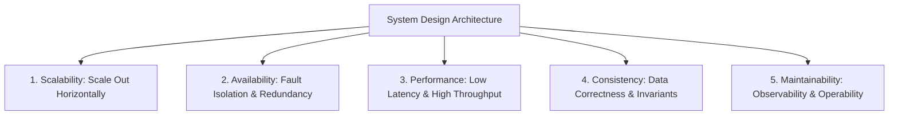
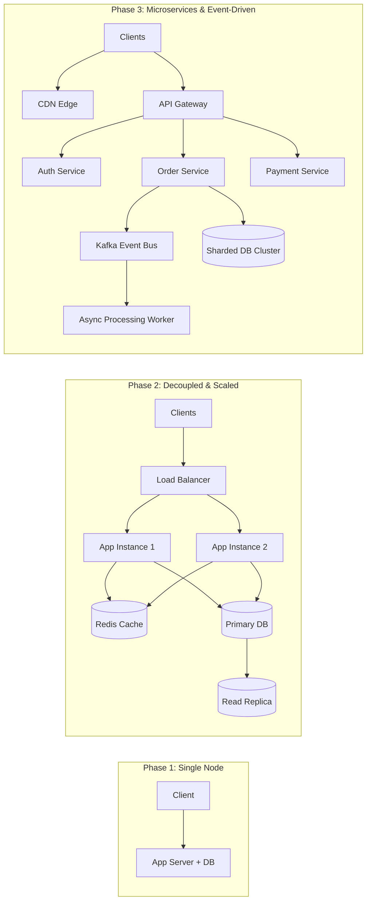

# What is System Design?

System Design is the process of defining the architecture, components, modules, interfaces, and data for a distributed computing system to satisfy specified business, scale, and reliability requirements.

---

## 1. What Problem Does It Solve?

In small-scale software engineering, a single monolithic application connected to a single relational database running on a single server is sufficient. However, as user traffic, data volume, and uptime requirements scale from thousands to hundreds of millions of users, single-node hardware limits are inevitably breached:

- **Vertical Scaling Limits**: A single server has physical constraints on CPU cores, RAM bandwidth, network interface card (NIC) throughput, and disk IOPS.
- **Single Point of Failure (SPOF)**: Hardware faults, kernel panics, or datacenter power cuts cause immediate, total service outages.
- **Latency & Global Distribution**: Speed of light limits network packet round-trip time (RTT). A user in Tokyo accessing a server in Virginia experiences a minimum ~160ms latency purely due to optical fiber physics.

System Design solves these fundamental limits by orchestrating **distributed clusters of heterogeneous machines** communicating over unreliable networks to appear as a single, cohesive, highly reliable service.

---

## 2. Core Pillars of System Design

1. **Scalability**: The ability of a system to handle increased load gracefully by adding computational resources (horizontal scaling) without redesigning core abstractions.
2. **Availability**: Ensuring the system remains accessible and operational even during server crashes, network partitions, and software deployments ($99.99\%$ to $99.999\%$ uptime).
3. **Performance**: Maintaining strict percentile latency bounds ($	ext{p}99 < 50	ext{ms}$) and maximizing request/data throughput under peak loads.
4. **Consistency & Correctness**: Preserving transactional and business invariants (e.g., no double-spending in payments, no duplicate bookings) despite concurrent mutations across distributed replicas.
5. **Maintainability & Observability**: Enabling engineering teams to deploy changes safely, debug anomalies in real-time, and evolve subsystems independently.

---

## 3. High-Level Evolution: From Monolith to Distributed Platform

---

## 4. Key Takeaways & Interview Application

- **System Design is About Trade-Offs**: There is no such thing as a "perfect" system. Every architectural decision sacrifices something (e.g., consistency for availability, latency for durability).
- **Think in Systems, Not Code**: You are designing distributed components, asynchronous event pipelines, storage paradigms, and failure boundaries—not individual classes or function loops.
- **Quantify Everything**: Abstract ideas must be backed by numbers (QPS, bytes per second, IOPS, cache hit ratios, and storage growth).
