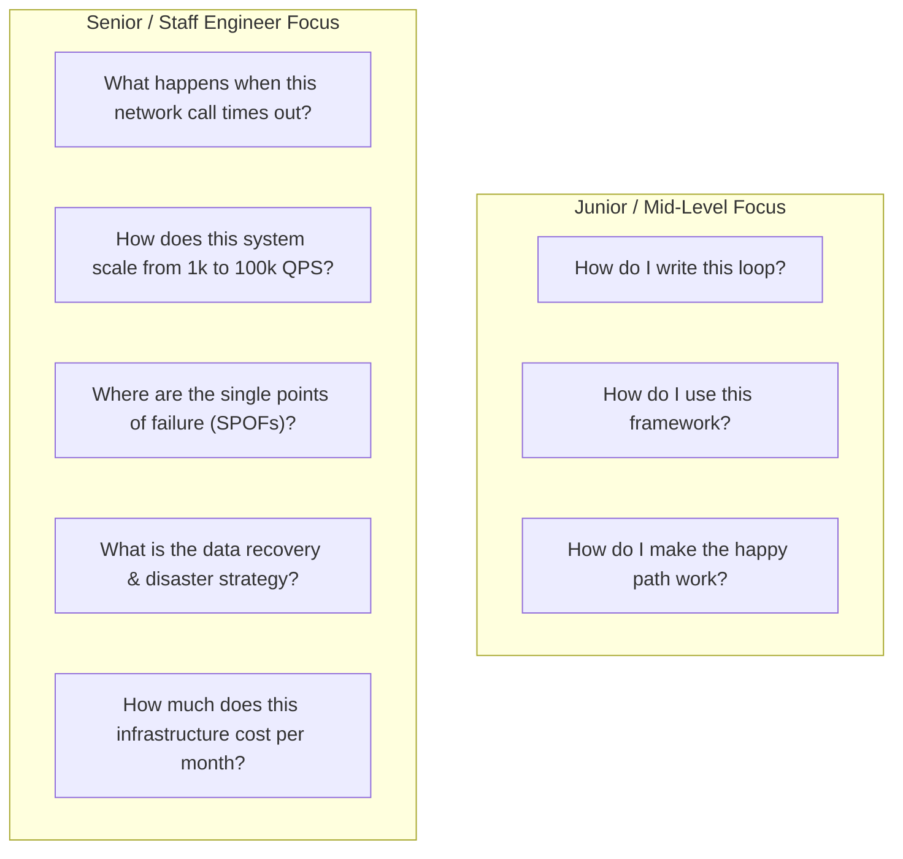

# Why System Design Matters

System Design is the defining skill that separates junior/mid-level engineers from **Senior Backend (SDE2)**, **Staff**, and **Principal Engineers**.

---

## 1. The Cost of Bad Architecture

In production environments, algorithmic inefficiencies can often be compensated by adding CPU cores, but **architectural flaws lead to catastrophic, company-level failures**:

| Architectural Flaw | Real-World Consequence | Example Failure |
|---|---|---|
| **Lack of Idempotency** | Double billing, duplicate order creation, ledger corruption. | Charging a user $5	imes$ during a network timeout retry. |
| **Missing Rate Limiting & Bulkheading** | Cascading failure across all microservices. | A single misbehaving client taking down the entire core database. |
| **Monolithic Shared Database** | Database lock contention, schema migration outages. | 2-hour downtime during an unindexed `ALTER TABLE` query. |
| **Inappropriate Consistency Model** | Split-brain data corruption, stale reads in critical paths. | Overbooking flights or hotel rooms across concurrent nodes. |

---

## 2. Senior vs Junior Engineering Mindset



---

## 3. What Top Tech Companies Evaluate in System Design

In interviews at Google, Meta, Amazon, Microsoft, Uber, and top startups, interviewers evaluate 5 key core dimensions:

```mermaid
radar
    title "System Design Candidate Evaluation Rubric"
    "Problem Scoping & Ambiguity Navigation" : 90
    "Architectural Decomposition" : 95
    "Distributed Systems Mechanics" : 85
    "Trade-Off Justification & Defense" : 90
    "Operational Resilience & Failure Recovery" : 85
```

1. **Problem Scoping**: Can you ask sharp questions, identify hidden constraints, and establish clear functional boundaries?
2. **High-Level Decomposition**: Can you break an ambiguous business product into clean, decoupled, single-responsibility services and data stores?
3. **Deep Distributed Systems Mechanics**: Do you understand partitioning, consistent hashing, replication lag, quorum reads/writes, caching invalidation, and consensus?
4. **Trade-Off Justification**: Can you articulate *why* you chose PostgreSQL over Cassandra, or Kafka over RabbitMQ, and defend the trade-offs?
5. **Production Hardening**: Can you identify failure modes (thundering herds, split-brain, poison pills) and proactively design resilient recovery paths?
