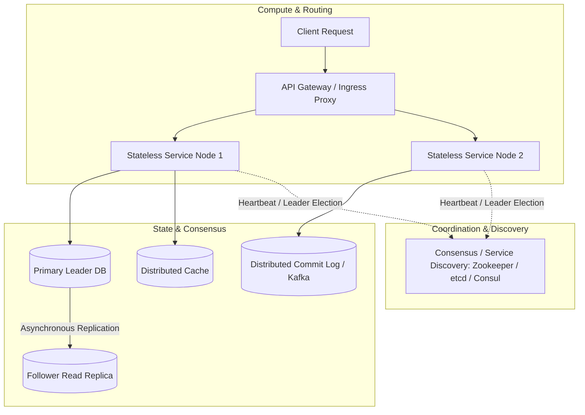

# Distributed Systems Overview

A distributed system is a collection of autonomous computing entities (nodes) that communicate over a shared network to coordinate actions and share state, appearing to end users as a single coherent system.

---

## 1. The Fallacies of Distributed Computing

L. Peter Deutsch and James Gosling identified the **8 Fallacies of Distributed Computing**—false assumptions that cause distributed software to fail:

1. **The network is reliable**: Packets drop, routers crash, fiber cables get severed.
2. **Latency is zero**: Inter-process communication across datacenters takes milliseconds, not nanoseconds.
3. **Bandwidth is infinite**: Splicing large payloads saturates network interfaces and switches.
4. **The network is secure**: Traffic over wire is subject to interception and man-in-the-middle attacks without mTLS.
5. **Topology does not change**: Cloud VMs terminate, IP addresses rotate, nodes join and leave dynamically.
6. **There is one administrator**: Different services are managed by different teams, cloud providers, and organizations.
7. **Transport cost is zero**: Serializing, deserializing, and marshaling JSON/Protobuf incurs CPU overhead.
8. **The network is homogeneous**: Nodes run diverse OS kernels, NIC drivers, and hardware capabilities.

---

## 2. Core Primitives of Distributed Systems

---

## 3. The Unavoidable Reality: Network Partitions & Clock Skew

Distributed systems face two fundamental physics constraints:
1. **Network Partitions ($P$)**: Nodes in a cluster can lose the ability to communicate with each other while continuing to operate independently.
2. **Clock Drift**: Physical quartz clocks on different servers drift by several milliseconds per day. Without specialized atomic hardware (e.g. Google TrueTime GPS/Atomic clocks), you cannot rely on wall-clock timestamps (`System.currentTimeMillis()`) to determine causal order across machines.

---

## 4. Fundamental Theorems Governing Distributed Architecture

- **CAP Theorem (Brewer)**: In the event of a Network Partition ($P$), a distributed system can guarantee either Consistency ($C$) or Availability ($A$), but **never both**.
- **PACELC Theorem (Abadi)**: If there is a Partition ($P$), trade off Availability ($A$) vs Consistency ($C$); **Else ($E$)**, trade off Latency ($L$) vs Consistency ($C$).
- **FLM Impossibility Principle**: In an asynchronous network, no deterministic consensus algorithm can guarantee agreement if even a single node can experience an unannounced crash failure.
