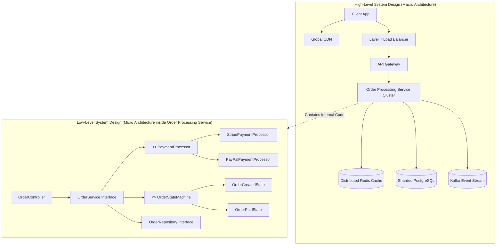

# System Design vs Low-Level Design (HLD vs LLD)

To succeed in senior engineering interviews and real-world software delivery, you must understand the clear division between **High-Level Design (HLD / System Design)** and **Low-Level Design (LLD / Object-Oriented Design)**.

---

## 1. Comparison Matrix

| Dimension | High-Level Design (HLD / System Design) | Low-Level Design (LLD / OOD) |
|---|---|---|
| **Primary Scope** | Macro-architecture, distributed nodes, data flow. | Micro-architecture, class diagrams, design patterns. |
| **Core Abstractions** | Services, Databases, Caches, Message Brokers, Gateways. | Classes, Interfaces, Design Patterns, SOLID principles. |
| **Scale Focus** | Millions of requests/sec, terabytes of data, multi-region. | Concurrency, memory efficiency, clean code, extensibility. |
| **Key Questions** | How do we shard the database? What is our caching topology? | Which design pattern should we use? How do we avoid race conditions? |
| **Deliverables** | Architecture diagrams, API schemas, capacity math, data models. | Class diagrams, sequence diagrams, runnable object-oriented code. |
| **Typical Target** | SDE2, Senior, Staff, Principal Engineers. | SDE1, SDE2, Machine Coding rounds. |

---

## 2. Visualizing the Boundary

---

## 3. How HLD and LLD Complement Each Other

1. **HLD sets the systemic boundaries**: It determines that the `Order Service` must communicate asynchronously with the `Inventory Service` via a Kafka topic to maintain high write availability.
2. **LLD implements the local invariants**: Inside the `Order Service`, LLD dictates that the consumer uses the **Factory Pattern** to deserialize event payloads, the **State Pattern** to transition order states, and a **ReentrantLock** or **ConcurrentHashMap** for in-memory deduplication before flushing to PostgreSQL.
