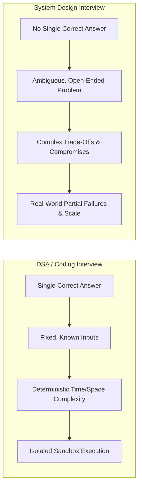

# System Design vs Coding Interviews

Understanding the fundamental shift between Data Structures & Algorithms (DSA / LeetCode) coding interviews and System Design interviews is critical to passing senior technical rounds.

---

## 1. Paradigm Shift

---

## 2. Key Differences in Evaluation

| Aspect | Coding / DSA Round | System Design Round |
|---|---|---|
| **Problem Statement** | Extremely specific (e.g. "Find the median of two sorted arrays in $\mathcal{O}(\log(m+n))$"). | Extremely broad (e.g. "Design YouTube" or "Design a Global Rate Limiter"). |
| **Interviewer Role** | Evaluator checking correctness, test cases, and edge cases. | Collaborator acting as a product/engineering partner. |
| **Success Criteria** | Working code with optimal asymptotic complexity ($\mathcal{O}(N)$). | Cohesive architecture, justified trade-offs, capacity estimation, and failure resilience. |
| **Communication Style** | Explain thought process while writing code on a single thread. | Lead an architectural dialogue, drive the agenda, defend engineering trade-offs. |
| **Failure Mode** | Failing to write working, bug-free code or missing optimal complexity. | Silence, jumping directly to drawing boxes without scoping, or giving rigid generic answers. |

---

## 3. The 3 Traps Coding-Centric Engineers Fall Into

1. **The "Silent Implementer" Trap**: Sitting silently for 10 minutes trying to formulate a complete architecture before speaking. System Design is an interactive whiteboard design review.
2. **The "Tech Keyword Dropper" Trap**: Randomly throwing buzzwords (*"I'll use Kafka, Redis, Cassandra, Kubernetes, and GraphQL!"*) without explaining *why* they are needed or how they scale.
3. **The "Happy Path Only" Trap**: Designing a system that works perfectly when all machines are healthy, but completely collapsing when a single database replica crashes or network latency spikes.
