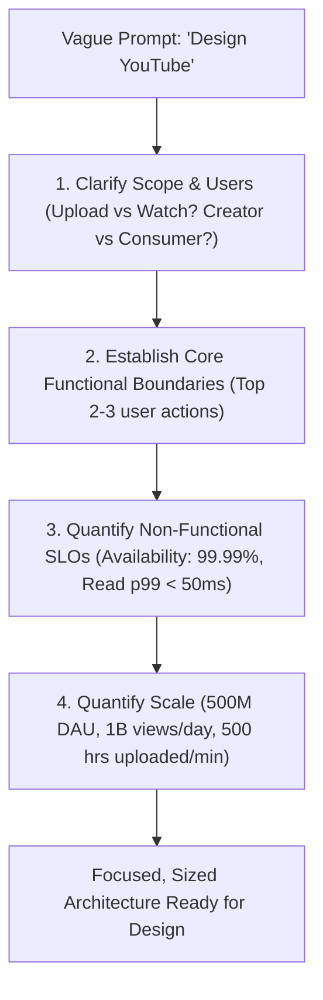

# How to Approach an Ambiguous System Design Problem

In production and in interviews, real-world problems are never handed to you with clean mathematical specifications. You will be given a single sentence: *"Design Twitter"* or *"Design a Parking Lot Billing System"*.

---

## 1. The Ambiguity Funnel

---

## 2. Step-by-Step Scoping Protocol

### Phase A: Clarify Product & Feature Boundaries (First 3-5 Minutes)
Never start drawing boxes until you have agreed on the **2 to 3 core user workflows**:
- *Interviewer Prompt*: "Design a File Storage Platform like Dropbox."
- *Clarifying Questions to Ask*:
  - Are we designing for web/mobile file synchronization or purely web upload/download?
  - Do we need automatic chunked file sync across devices when a file is edited locally?
  - Are we supporting collaborative real-time document editing, or generic binary blob storage?
  - Is file sharing and permission management (RBAC) in scope?

### Phase B: Define What is Explicitly OUT OF SCOPE
Proactively bounding the problem demonstrates senior engineering maturity:
- *"For this 45-minute session, I will focus deeply on: (1) Chunked reliable file upload with deduplication, (2) Fast file download, and (3) Cross-device sync notifications. I will treat user billing, video transcoding, and comment threads as out of scope unless we have extra time."*

### Phase C: Agree on System Invariants & Non-Functional Priorities
Ask the interviewer to clarify the trade-off priorities:
- **Read-Heavy vs Write-Heavy**: What is the expected read-to-write ratio?
- **Consistency vs Availability**: For an e-commerce inventory service, strong consistency is mandatory. For a social feed, eventual consistency is acceptable.
- **Latency Targets**: What are the strict p95/p99 latency Service Level Objectives (SLOs)?
