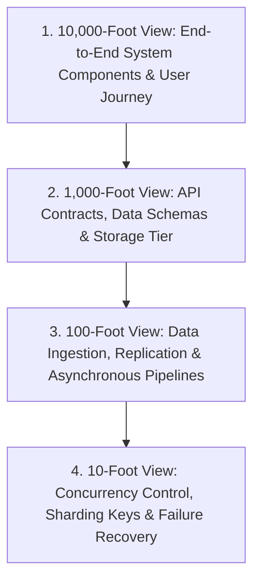

# How to Communicate Architecture

System Design interviews are fundamentally **communication and technical leadership assessments**. Even the most elegant architecture will fail the interview if you cannot structure and articulate your reasoning clearly.

---

## 1. The "Top-Down" Communication Hierarchy

Always communicate architecture from the highest abstraction layer down to deep internal mechanics:

---

## 2. The 4 Rules of Whiteboard / Diagramming Communication

1. **Name Every Component Explicitly**: Never draw an unlabeled box. Use exact descriptors: `L7 Envoy Proxy`, `User Metadata DB (PostgreSQL Primary)`, `Timeline Cache (Redis Cluster)`.
2. **Indicate Data Flow with Arrows**: Draw directional arrows representing synchronous requests (`──>` solid line) versus asynchronous event streaming (`- - ->` dashed line).
3. **Number the Request Steps**: When tracing a flow, walk through numbered sequence steps ($1, 2, 3, \dots$) so the interviewer can follow the lifecycle of a request from client to database.
4. **State Assumptions Before Calculating**: Before estimating cache size, state your rule explicitly: *"Assuming an 80-20 Pareto distribution where 20% of the hot videos generate 80% of daily traffic..."*

---

## 3. Verbalizing Technical Choices (The "Because... Therefore..." Formula)

When selecting any technology or design pattern, use the 3-part structured justification:

$$	ext{Context / Constraint} \longrightarrow 	ext{Trade-off Analysis} \longrightarrow 	ext{Architectural Decision}$$

- **Example (Choosing Cassandra for Time-Series Metrics)**:
  > *"Because our system ingests $500,000$ metric writes per second with append-only access patterns and no relational joins, a relational B-Tree database would suffer from high write amplification. Therefore, I choose a distributed wide-column store like Apache Cassandra with an LSM-Tree storage engine, which provides $\mathcal{O}(1)$ sequential memory-to-disk append throughput."*
