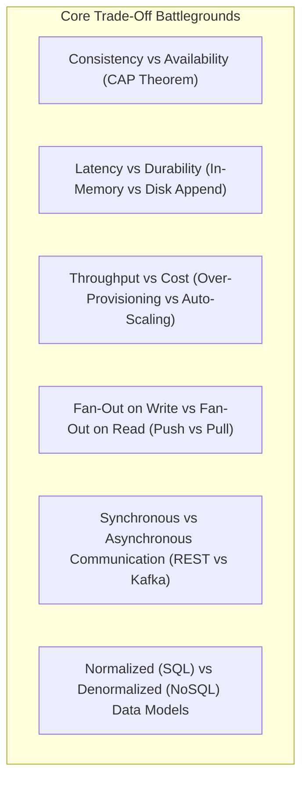
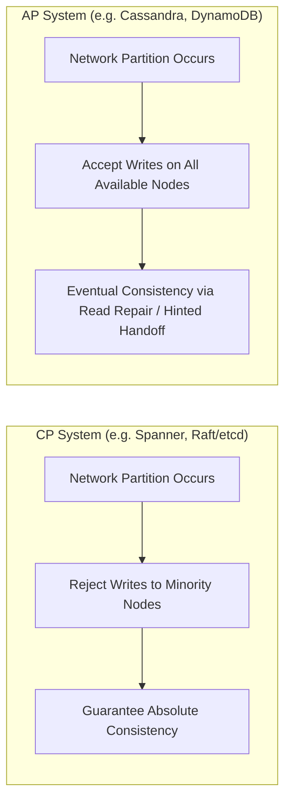

# How to Reason About Trade-Offs

In senior and staff system design, there are **no right answers—only trade-offs**. Demonstrating the ability to weigh opposing architectural forces is the primary signal for Senior/Staff engineering competence.

---

## 1. The Core Architectural Battlegrounds

---

## 2. Deep Dive: 4 Classic Architectural Dilemmas

### Dilemma 1: Fan-out on Write (Push) vs Fan-out on Read (Pull)
- **Fan-out on Write (Push)**:
  - *Mechanism*: When a user posts, immediately insert the post ID into every follower's pre-computed timeline cache.
  - *Advantage*: $\mathcal{O}(1)$ blazing fast read latency ($	ext{p}99 < 10	ext{ms}$).
  - *Disadvantage*: Massive write amplification when a celebrity with 80M followers posts ($80	ext{M}$ Redis writes).
- **Fan-out on Read (Pull)**:
  - *Mechanism*: When a user opens their feed, query the databases of all people they follow, merge, and sort.
  - *Advantage*: $\mathcal{O}(1)$ cheap write operations.
  - *Disadvantage*: High read latency $\mathcal{O}(K \log N)$ and massive database load on active feed refreshes.
- **The Senior Synthesis**: Hybrid approach—Push for regular users ($< 25	ext{k}$ followers); Pull on-demand for celebrity accounts.

---

### Dilemma 2: Strong Consistency vs High Availability

---

## 3. How to Defend Trade-offs to an Interviewer

1. Acknowledge what you are **sacrificing**: *"By using an asynchronous write-behind cache here, we gain sub-5ms write latencies..."*
2. Identify the **failure window**: *"...however, if the Redis node crashes before flushing dirty pages to PostgreSQL, we risk losing up to 2 seconds of non-critical user activity data."*
3. Justify why this sacrifice is **acceptable for the business domain**: *"For user profile view counters, losing a few increments during an ungraceful crash is completely acceptable in exchange for protecting our primary SQL cluster from 100k QPS write spikes."*
