# Interview Time Management (The 45-Minute Clock)

System Design interviews typically run for **45 minutes**. Running out of time before addressing bottlenecks, data models, or failure handling is one of the most common failure reasons.

---

## 1. The 45-Minute Allocation Timeline

```mermaid
gantt
    title 45-Minute System Design Interview Time Allocation
    dateFormat mm
    axisFormat %M min
    section Interview Phases
    Requirements & Scoping (5 min) :00, 5m
    Scale & Capacity Estimation (5 min) :05, 5m
    High-Level Architecture (10 min) :10, 10m
    Data Model & Deep Dive (15 min) :20, 15m
    Failure Handling & Bottlenecks (7 min) :35, 7m
    Summary & Q&A (3 min) :42, 3m
```

---

## 2. Phase-by-Phase Execution Checklist

### Minute 00 – 05: Requirements Scoping
- [ ] Clarify top 2–3 functional requirements.
- [ ] State 3 non-functional requirements (Availability, Latency, Consistency).
- [ ] Explicitly state what is out of scope.

### Minute 05 – 10: Scale & Capacity Estimation
- [ ] Calculate Read QPS & Write QPS (include $3	imes$ peak multiplier).
- [ ] Estimate 5-year storage growth (Data size per record $	imes$ Daily writes $	imes 365 	imes 5$).
- [ ] Estimate Cache RAM sizing (80-20 rule $	o$ 20% of daily read volume in RAM).
- [ ] Estimate Network Egress/Ingress bandwidth.

### Minute 10 – 20: High-Level Architecture
- [ ] Draw Client $	o$ DNS $	o$ CDN $	o$ Load Balancer $	o$ API Gateway.
- [ ] Draw primary microservices (stateless compute tier).
- [ ] Draw primary storage engines and distributed caches.
- [ ] Trace end-to-end Read Flow (1, 2, 3) and Write Flow (A, B, C).

### Minute 20 – 35: Data Model & Deep Dive
- [ ] Define relational vs NoSQL schemas, primary keys, and sharding keys.
- [ ] Deep dive into 1 or 2 core algorithmic challenges (e.g., Trie ranking, S2 geospatial indexing, Kafka consumer partition balancing).
- [ ] Validate alignment with the interviewer: *"Would you like me to dive deeper into the database sharding strategy, or explore the real-time notification engine?"*

### Minute 35 – 42: Failure Scenarios & Production Hardening
- [ ] Identify and eliminate Single Points of Failure (SPOFs).
- [ ] Address cache stampedes, hot keys, replication lag, and network partitions.
- [ ] Introduce rate limiters, circuit breakers, and dead-letter queues.

### Minute 42 – 45: Wrap Up & Review
- [ ] Summarize how the design satisfies the initial functional and non-functional requirements.
- [ ] Answer final technical questions from the interviewer.
