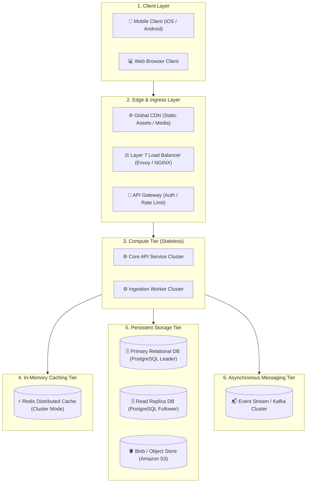

# Architecture Diagramming Standards

A whiteboard or digital architecture diagram is the visual contract between you and your interviewer. Clean, standardized diagrams prevent confusion and project senior architectural competence.

---

## 1. Visual Hierarchy & Standard Symbols

---

## 2. Best Practices for Diagramming in Interviews

1. **Separate Stateless Compute from Stateful Storage**: Always show application servers as stateless worker instances that can be scaled horizontally behind a load balancer.
2. **Explicit Storage Types**: Do not just write `"Database"`. Specify the exact paradigm: `PostgreSQL (ACID User Metadata)`, `Cassandra (Time-Series Activity Log)`, `S3 (Raw Video Files)`.
3. **Use Line Styles to Differentiate Synchronous vs Asynchronous Paths**:
   - **Solid Arrow (`-->`)**: Synchronous HTTP/REST or gRPC blocking call.
   - **Dashed Arrow (`-.->`)**: Asynchronous event publishing, CDC replication, or background worker task.
4. **Number the Execution Lifecycle**: Annotate arrows with sequence numbers ($1 	o 2 	o 3$) when explaining end-to-end request flows.
