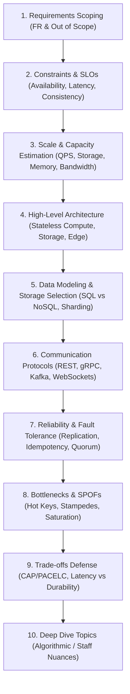

# The DESIGN-FLOW Interview Framework

The **DESIGN-FLOW** framework is an original, 10-step systematic framework engineered to structure the entire 45-minute System Design interview.

---

## 1. The 10-Step Sequential Flow

---

## 2. Phase-by-Phase Interview Schedule

| Step | Phase Name | Ideal Duration | Core Goal |
|:---:|---|:---:|---|
| **1** | **Requirements Scoping** | 3 mins | Extract 2–3 core user workflows; define what is out of scope. |
| **2** | **Constraints & SLOs** | 2 mins | Define availability targets (99.99%), latency SLAs (p99 < 50ms), consistency rules. |
| **3** | **Scale & Sizing** | 5 mins | Calculate Read/Write QPS, peak multipliers, 5-year storage, cache RAM. |
| **4** | **High-Level Architecture** | 8 mins | Draw the end-to-end block diagram from client to storage. |
| **5** | **Data Model & Schema** | 6 mins | Define relational vs NoSQL schemas, primary keys, indexing, and sharding keys. |
| **6** | **Communication Protocols** | 3 mins | Justify sync (gRPC/REST) vs async (Kafka), event contracts, and WebSocket paths. |
| **7** | **Reliability & Resiliency** | 5 mins | Integrate multi-AZ replication, failover, idempotency, circuit breakers. |
| **8** | **Bottlenecks & SPOFs** | 4 mins | Identify single points of failure, hot partitions, thundering herd risks. |
| **9** | **Trade-Offs Defense** | 4 mins | Articulate why chosen tradeoffs fit the business constraints. |
| **10**| **Deep Dive & Staff Nuances** | 5 mins | Explore custom algorithms, consensus, or edge optimizations. |

---

## 3. Why DESIGN-FLOW Outperforms Generic Approaches

1. **Prevents Premature Optimization**: Forces you to establish functional boundaries and quantitative scale *before* drawing architectural components.
2. **Builds a Cohesive Narrative**: Every box on your whiteboard maps directly back to a functional requirement or scale constraint established in Steps 1–3.
3. **Proactive Senior Signals**: Systematically addresses bottlenecks, single points of failure, and trade-off defense without waiting for the interviewer to prompt you.
