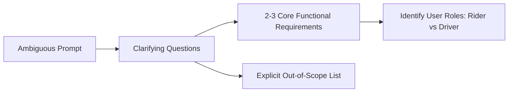

# Step 1: Requirements Scoping

The goal of Step 1 is to transform an ambiguous prompt (e.g. *"Design Uber"*) into 2–3 crystal-clear functional requirements within **3 minutes**.

---

## 1. The Scoping Protocol

---

## 2. What to Ask vs What NOT to Ask

### Great Scoping Questions (Shows Senior Maturity)
- *"Who are the primary actors in this system? For Uber, are we designing for both Passenger and Driver experiences?"*
- *"What are the core user actions we must optimize for? For ride hailing: (1) Driver location tracking, (2) Rider requesting a ride, (3) Matching engine."*
- *"Are there geographical constraints? Is this a single-metro deployment or a globally distributed multi-region platform?"*

### Bad Questions (Avoid)
- *"Should I use Redis or PostgreSQL?"* (Too early—that belongs in Step 4/5).
- *"How many servers do you want me to use?"* (You are expected to calculate this in Step 3).

---

## 3. The "Scope Statement" Deliverable

Always end Step 1 by writing the agreed scope on the whiteboard:

> **Functional Requirements**:
> 1. **FR-1**: Riders can view nearby available drivers in real-time.
> 2. **FR-2**: Riders can request a ride and get matched with the nearest available driver within 5 seconds.
> 3. **FR-3**: Drivers can accept/reject rides and continuously stream their GPS coordinates.
>
> **Out of Scope (Post-MVP)**:
> - User rating systems, payment split among riders, scheduled rides, surge pricing algorithms (unless time permits).
