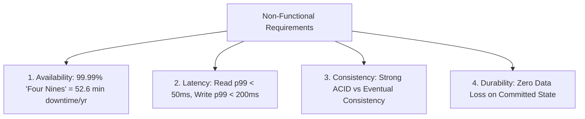

# Step 2: Constraints & SLOs

Non-functional requirements (NFRs) define the operational invariants that your architecture must satisfy.

---

## 1. The Core 4 System Invariants

---

## 2. Defining Service Level Objectives (SLOs)

| Metric | Target SLO | Architectural Implication |
|---|---|---|
| **Availability** | $99.99\%$ (Four Nines) | Multi-AZ redundant deployments, auto-failover, health checks. |
| **Read Latency** | $	ext{p}99 < 50	ext{ms}$ | Multi-tier distributed caching (Redis/Memcached), CDN edge distribution. |
| **Write Latency** | $	ext{p}99 < 200	ext{ms}$ | Asynchronous message queues (Kafka), append-only write paths (LSM). |
| **Consistency** | Strong for payments; Eventual for feeds | Multi-version concurrency control (MVCC), Read-Your-Writes replication. |
| **Durability** | $99.999999999\%$ (11 Nines) | Multi-region synchronous WAL replication, RAID, Amazon S3 storage tier. |

---

## 3. The CAP/PACELC Alignment

State your system's fundamental trade-off alignment upfront:
- *"For this payment platform, our system is strictly **CP** under PACELC: we prioritize Consistency over Availability during network partitions, and Consistency over Latency during normal operations."*
- *"For this social feed platform, our system is **AP**: we prioritize Availability over Consistency, accepting transient replication lag in exchange for sub-20ms feed rendering."*
