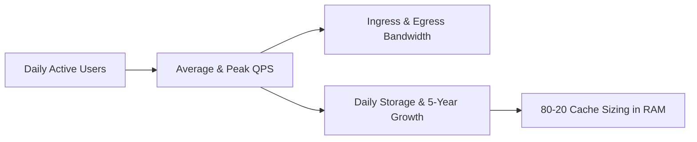

# Step 3: Scale & Sizing (Capacity Estimation)

In Step 3, you convert user activity assumptions into concrete engineering units: **Queries Per Second (QPS)**, **Network Bandwidth (MB/s)**, **Memory Sizing (GB RAM)**, and **Storage Trajectory (TB/5 years)**.

---

## 1. The Core Capacity Math Pipeline

---

## 2. Standard Mathematical Formulas

### A. Queries Per Second (QPS)
$$	ext{Average QPS} = rac{	ext{DAU} 	imes 	ext{Average Actions Per User}}{86,400 	ext{ seconds/day}}$$

$$	ext{Peak QPS} = 	ext{Average QPS} 	imes 	ext{Peak Multiplier } (2	imes 	ext{ to } 5	imes)$$

### B. Storage Trajectory
$$	ext{Daily Storage} = 	ext{Daily Writes} 	imes 	ext{Average Payload Size}$$

$$	ext{5-Year Storage} = 	ext{Daily Storage} 	imes 365 	imes 5 	imes (1 + 	ext{Index/Replication Overhead } 0.3)$$

### C. Cache Memory Sizing (80-20 Pareto Rule)
$$	ext{Cache RAM} = 	ext{Daily Read Volume} 	imes 0.20$$

---

## 3. Worked Example: TinyURL / URL Shortener

- **Assumptions**:
  - $100	ext{M}$ new URLs created per month ($1.2	ext{B}$/year).
  - Read-to-Write ratio = $100:1$ ($100$ reads per URL write).
  - Average URL record size = $500	ext{ bytes}$.
- **Calculations**:
  - **Write QPS**: $rac{100	ext{M}}{30 	imes 86,400} pprox 40	ext{ writes/sec}$ (Peak = $100	ext{ writes/sec}$).
  - **Read QPS**: $40 	imes 100 = 4,000	ext{ reads/sec}$ (Peak = $10,000	ext{ reads/sec}$).
  - **5-Year Storage**: $1.2	ext{B/yr} 	imes 5	ext{ yrs} 	imes 500	ext{ bytes} = 3	ext{ TB}$.
  - **Daily Read Memory**: $4,000	ext{ QPS} 	imes 86,400 	imes 500	ext{ bytes} pprox 172.8	ext{ GB/day}$.
  - **Cache Size (20%)**: $172.8	ext{ GB} 	imes 0.20 pprox 35	ext{ GB RAM}$ (Easily hosted on a 2-node Redis cluster).
