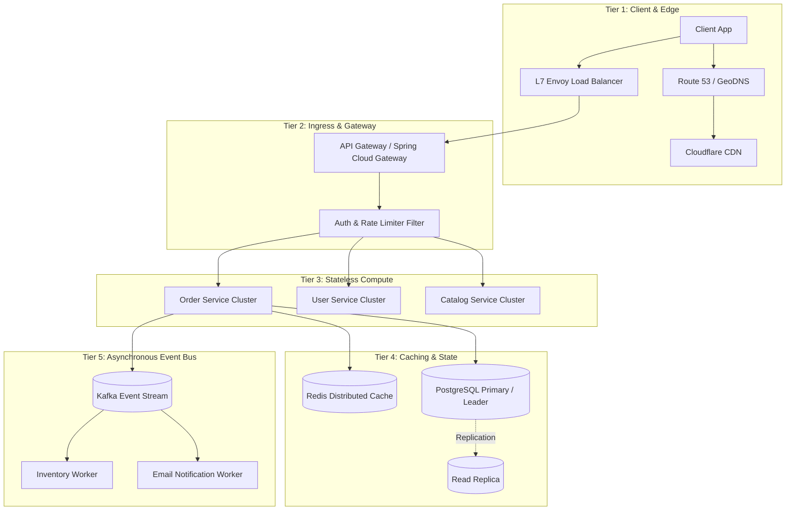

# Step 4: High-Level Architecture

Step 4 is where you establish the end-to-end macro architecture. The key is to start with a clean separation of concerns before diving into complex database internals.

---

## 1. Standard 5-Tier Architecture

---

## 2. Essential Architectural Guidelines

1. **Stateless Compute**: Application servers must store zero user session state in local memory. All state resides in distributed caches (Redis) or persistent databases.
2. **Decouple Synchronous from Asynchronous Paths**:
   - Synchronous (Blocking): User-facing CRUD operations requiring immediate responses ($< 100	ext{ms}$).
   - Asynchronous (Non-Blocking): Notifications, search index updates, heavy analytics, batch transcoding.
3. **Trace the End-to-End Flow**: Walk through a complete request lifecycle with numbered steps ($1 	o 2 	o 3 	o 4$) to prove component integration.
