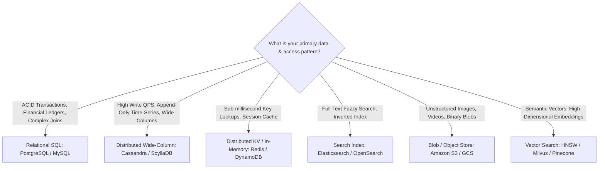

# Step 5: Data Modeling & Storage Selection

Data modeling in System Design is not just writing SQL tables; it is choosing the correct **storage paradigm** and defining the **sharding key** that prevents hot partitions.

---

## 1. Storage Engine Decision Matrix

---

## 2. Defining Schemas & Sharding Keys

When presenting a data model in an interview:
1. **Define Core Entities**: Name fields, types, and primary keys.
2. **Identify the Sharding / Partition Key**: Choose a partition key with high cardinality and even write distribution (e.g. `user_id` or `hash(tenant_id)`).
3. **Analyze Access Patterns**: Ensure that 95%+ of queries can be satisfied from a single partition without requiring costly cross-partition scatter-gather queries.
