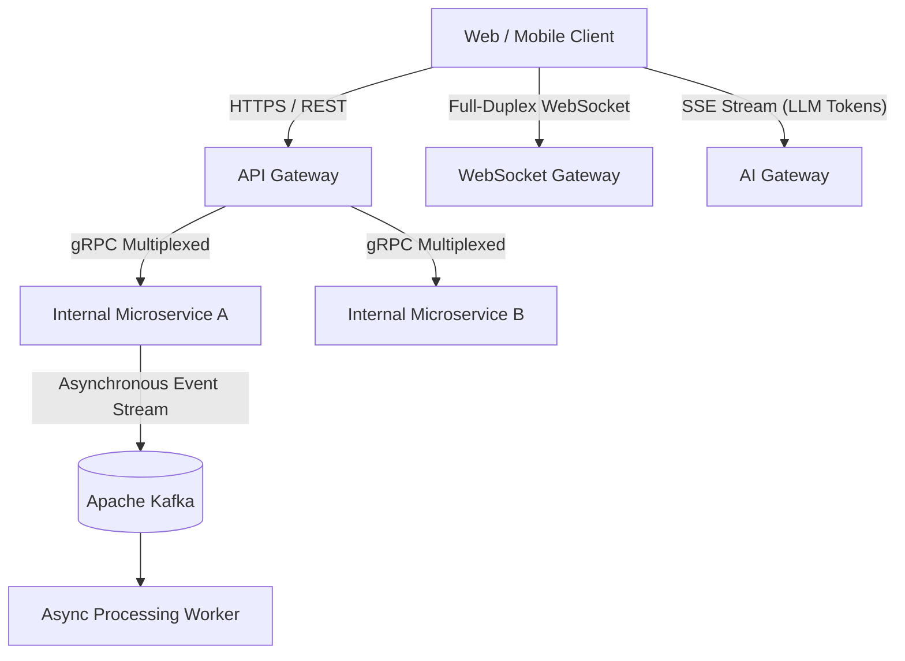

# Step 6: Communication Protocols

Choosing the right transport protocol and serialization format dictates system latency, throughput, and connection concurrency.

---

## 1. Protocol Comparison Matrix

| Protocol | Transport | Typical Use-Case | Pros | Cons |
|---|---|---|---|---|
| **REST over HTTP/1.1** | TCP / Text JSON | Public APIs, CRUD endpoints | Ubiquitous, human-readable, universal tooling | Head-of-line blocking, heavy text serialization overhead |
| **gRPC over HTTP/2** | TCP / Binary Protobuf | Inter-microservice internal RPC | Multiplexing, binary compact payloads, strict IDL contracts | Requires gRPC clients, harder browser debugging |
| **WebSocket** | TCP / Full-Duplex | Real-time chat, live location, collaborative docs | Sub-millisecond bi-directional streaming, low per-message header overhead | Stateful connections require dedicated gateway servers |
| **Server-Sent Events (SSE)**| HTTP/2 / One-Way Stream | LLM token streaming, live score tickers | Lightweight, native browser reconnect, firewall-friendly | One-way only (Server $	o$ Client) |
| **Kafka / AMQP** | TCP / Binary Logs | Event-driven choreography, asynchronous processing | High throughput (millions/sec), disk durability, consumer replay | Async latency ($10	ext{ms} - 500	ext{ms}$), eventual consistency |

---

## 2. Visualizing Connection Topology

