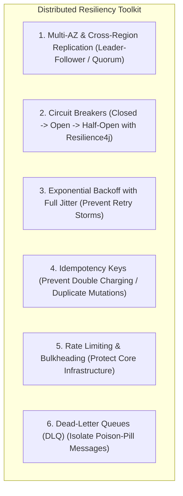
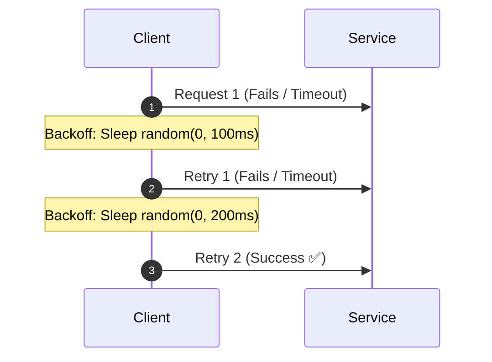

# Step 7: Reliability & Fault Tolerance

A senior architect designs systems assuming that **everything will fail at scale**: servers will crash, networks will partition, disks will corrupt, and downstream APIs will time out.

---

## 1. Core Resiliency Patterns

---

## 2. Exponential Backoff with Full Jitter

When retrying failed network requests, naive fixed retries cause devastating **retry storms**. Adding full random jitter spreads out client retries across time:

$$t_{	ext{sleep}} = 	ext{random}(0, \min(t_{	ext{max}}, t_{	ext{base}} 	imes 2^{	ext{attempt}}))$$

