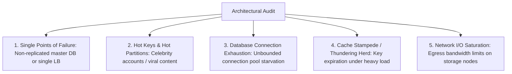

# Step 8: Bottlenecks & Single Points of Failure (SPOFs)

In Step 8, you audit your own architecture to identify and eliminate bottlenecks before the interviewer points them out.

---

## 1. Identifying the 5 Classic Bottlenecks

---

## 2. Proactive Mitigations

| Bottleneck | Architectural Vulnerability | Mitigation Strategy |
|---|---|---|
| **Hot Partition (Celebrity)** | Single partition node saturates in CPU/IOPS. | Salted sharding keys (`user_id + "_" + rand(0, 9)`), local application-level caching. |
| **Cache Stampede** | Hot cache key expires; $10,000$ concurrent requests hit database. | Distributed mutex locking (Singleflight), Probabilistic Early Expiration (XFetch algorithm). |
| **Database Pool Starvation**| Slow analytical query blocks all API connections. | Read/Write splitting, strict query timeouts ($500	ext{ms}$), dedicated connection pools. |
| **SPOF on Primary DB** | Primary database crashes; writes completely fail. | Automated failover with Raft/Patroni, Multi-AZ standby replica with synchronous replication. |
