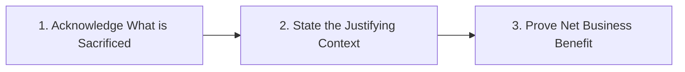

# Step 9: Trade-offs Defense

Step 9 is your opportunity to summarize why your architecture is the optimal compromise for the specified business problem.

---

## 1. The 3-Step Trade-off Articulation Formula

1. **Acknowledge the sacrifice**: *"By using an asynchronous write-behind cache with Kafka, we accept an eventual consistency window of up to 200ms between primary database updates and follower replicas..."*
2. **State the justifying context**: *"...however, our requirement specifies a write throughput of $50,000$ post likes/sec where sub-5ms write acknowledgment is critical to user experience..."*
3. **Prove net business benefit**: *"...therefore, eventual consistency provides a $10	imes$ throughput increase and protects our core relational database from write saturation, while the transient inconsistency has zero financial impact."*

---

## 2. Classic Trade-offs Checklist

- [ ] **Consistency vs Availability**: CP (Financial) vs AP (Social Media).
- [ ] **Throughput vs Latency**: Batch processing (high throughput, high latency) vs Streaming (low throughput per batch, sub-millisecond latency).
- [ ] **Storage Cost vs Query Speed**: Denormalized NoSQL (fast single-partition reads, data redundancy) vs Normalized SQL (zero redundancy, multi-table join latency).
