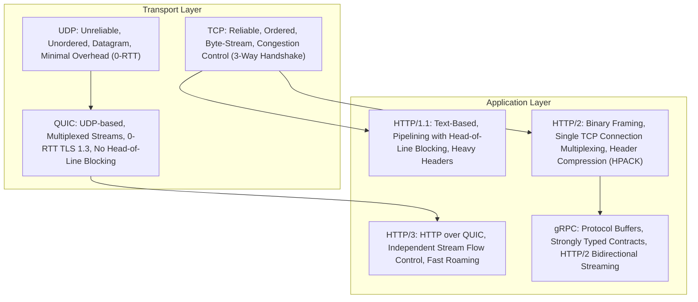

# Network Abstractions in Distributed Systems

At the core of all distributed systems lies the network: an asynchronous, packet-switched, unreliable communication medium connecting isolated computing nodes.

---

## 1. The Protocol Stack: Transport to Application

---

## 2. HTTP/1.1 vs HTTP/2 vs HTTP/3 vs gRPC

| Feature | HTTP/1.1 | HTTP/2 | HTTP/3 (QUIC) | gRPC |
|---|---|---|---|---|
| **Transport** | TCP | TCP | UDP (QUIC) | TCP (HTTP/2) |
| **Framing** | Plaintext (ASCII) | Binary Frames | Binary Frames | Binary (Protobuf) |
| **Multiplexing** | No (HOL blocking) | Yes (Application-level) | Yes (Transport-level) | Yes |
| **Header Compression** | None | HPACK | QPACK | HPACK |
| **Stream Independence** | N/A | Packet drop halts all streams | Packet drop only halts affected stream | Packet drop halts all streams |
| **Best For** | Public Web APIs | Web Browsers | Mobile / High Packet Loss | Internal Microservices |

---

## 3. Network Connection Pooling & Keep-Alive

Establishing a TCP connection requires a 3-way handshake ($\text{SYN} \to \text{SYN-ACK} \to \text{ACK}$) plus TLS negotiation ($1\text{ to }2\text{ RTTs}$). In high-throughput distributed systems:
- **Connection Reuse (`Keep-Alive`)**: Keep TCP sockets open across multiple HTTP requests.
- **Connection Pools (HikariCP, Envoy)**: Pre-allocate and maintain a warm pool of connections to downstream databases and microservices, reducing per-request latency from $> 50\text{ms}$ to $< 1\text{ms}$.
