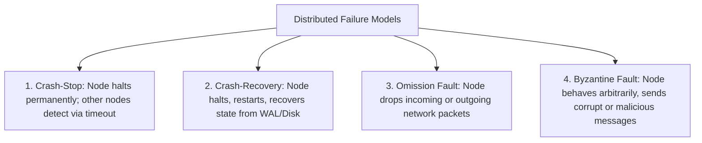
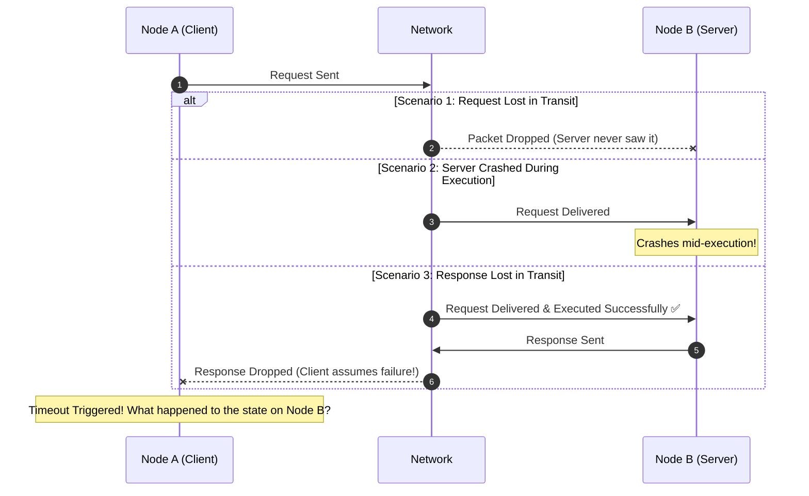

# Partial Failure & Failure Models

The defining characteristic of distributed computing is **partial failure**: one component fails while the rest of the system continues to operate in an unknown state.

---

## 1. Classical Distributed Failure Taxonomy

---

## 2. The Anatomy of a Timeout: The Tri-State Uncertainty

When Node A sends a network request to Node B and receives no response within a timeout period, Node A is left in **tri-state uncertainty**:

---

## 3. Fault Detection: Heartbeats, Leases & Phi Accrual

To distinguish between a slow node and a dead node:
- **Periodic Heartbeats**: Nodes broadcast keep-alive pings every $T_{\text{heartbeat}}$ seconds. Missing $K$ consecutive heartbeats marks the node as dead.
- **Leases**: A bounded time-based token granted by a coordinator. If the lease expires without renewal, the node loses authority to mutate state.
- **$\Phi$-Accrual Failure Detector (Cassandra / Akka)**: Rather than binary alive/dead decisions, it calculates a continuous suspicion probability metric $\Phi$ based on historical heartbeat intervals.
