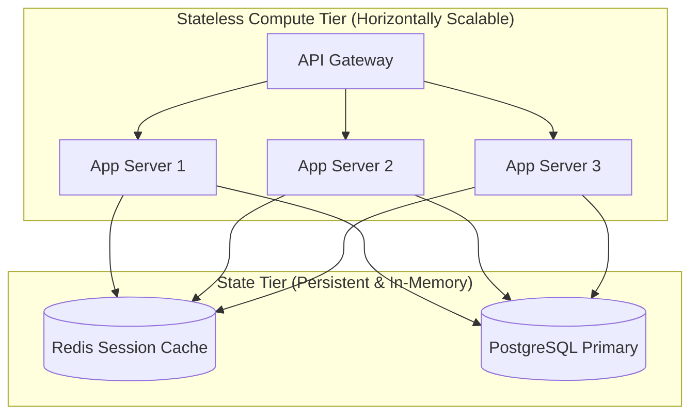
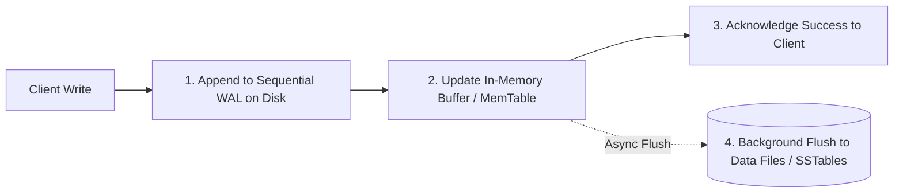

# Distributed State Management

Managing application state across multiple machines determines whether a system can scale horizontally and recover from catastrophic node failures.

---

## 1. Stateless vs Stateful Tier Decomposition

- **Stateless Tier**: Nodes hold zero in-memory client state between requests. Any request can be routed to any instance. Scale-out is trivial: add instances behind a Load Balancer.
- **Stateful Tier**: Nodes hold mutable state (databases, in-memory caches, message queues). Scaling requires **partitioning**, **replication**, and **distributed concurrency control**.

---

## 2. Write-Ahead Logging (WAL) for Crash Recovery

To guarantee durability ($D$ in ACID) without performing slow random disk writes on every transaction:

If the server crashes at step 3, upon reboot it replays the sequential WAL from the last checkpoint, restoring memory state with zero data loss.
