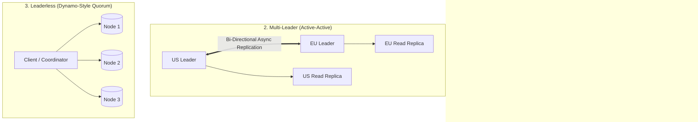
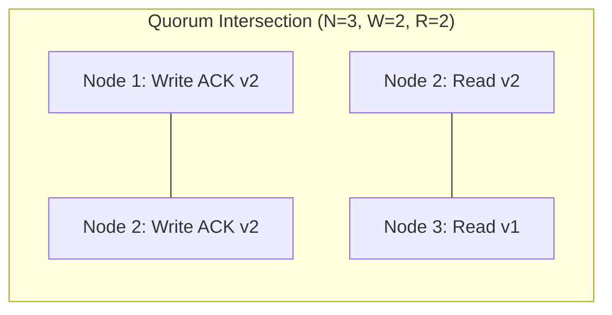

# Distributed Replication Strategies

Replication is the process of storing copies of the same data on multiple physical machines to ensure **high availability**, **fault tolerance**, and **low-latency geographic reads**.

---

## 1. The 3 Core Replication Models

---

## 2. Leaderless Quorum Mathematics ($R + W > N$)

In Dynamo-style distributed stores (Amazon DynamoDB, Apache Cassandra):
- $N$ = Total replication factor (total copies of data).
- $W$ = Number of nodes that must acknowledge a write before returning success.
- $R$ = Number of nodes that must respond to a read before returning the latest value.

$$\text{Strong Consistency (Strict Quorum)} \iff R + W > N$$

Because $W=2$ and $R=2$ out of $N=3$, at least one node (Node 2) is guaranteed to be in both the write set and read set, ensuring the client reads the latest version $\text{v}2$.
