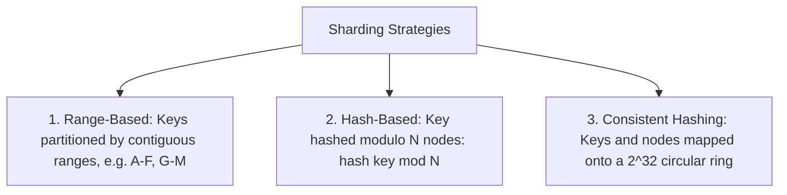
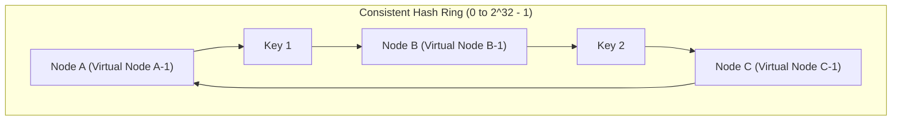

# Partitioning & Sharding

Partitioning (sharding) divides massive datasets into smaller, independent subsets distributed across multiple physical storage nodes to scale beyond single-machine disk and throughput limits.

---

## 1. Partitioning Strategies

---

## 2. Consistent Hashing with Virtual Nodes

Traditional `hash(key) % N` causes catastrophic cache invalidation when a node is added or removed: almost all keys remap to new servers. **Consistent Hashing** ensures that adding a node only migrates $\frac{K}{N}$ keys.

- **Virtual Nodes (vnodes)**: Each physical machine is mapped to 100–250 points on the hash ring. This eliminates hot spots and ensures balanced data distribution across heterogeneous hardware.
