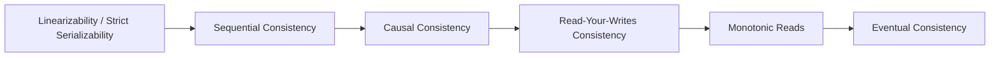

# Distributed Consistency Models

Consistency models define the contract between a distributed storage system and its clients regarding the ordering and visibility of concurrent read and write operations.

---

## 1. The Consistency Spectrum

---

## 2. Key Models Defined

| Consistency Model | Definition | Implementation Mechanism | Typical System |
|---|---|---|---|
| **Linearizability (Strong)** | Real-time global order. Once a write completes, all subsequent reads across all nodes immediately return the new value. | Consensus (Raft/Paxos), Synchronized Clocks (TrueTime), 2-Phase Locking. | Google Spanner, etcd, Zookeeper |
| **Sequential Consistency** | Operations take effect in some sequential order consistent with the program order of each individual node. | Total order broadcast, logical sequence numbers. | JVM memory model, CPU caches |
| **Causal Consistency** | Operations that are causally related must be seen in the same order by all nodes; concurrent independent operations may be seen in different orders. | Vector Clocks, Lamport timestamps. | Riak, Cosmos DB |
| **Read-Your-Writes** | A user who updates a record will always see their own update on subsequent reads (no stale view for the writer). | Route user's reads to primary leader for $T_{\text{lag}}$ seconds, or track version tokens. | Social networks, e-commerce profiles |
| **Eventual Consistency** | If no new updates are made, all replicas will eventually converge to identical values. | Gossip protocols, Read Repair, Hinted Handoff, Anti-Entropy Merkle trees. | Cassandra, DynamoDB, DNS |
