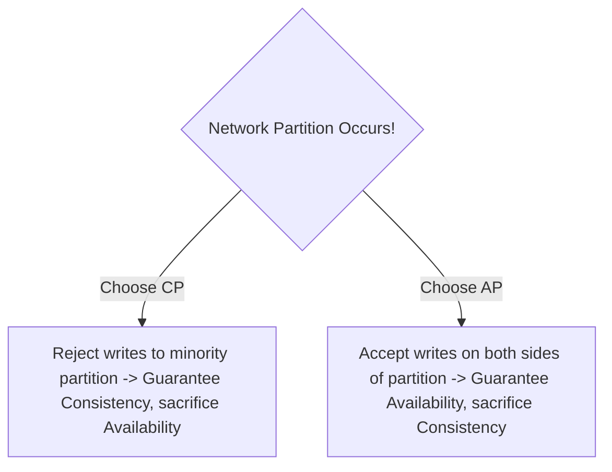
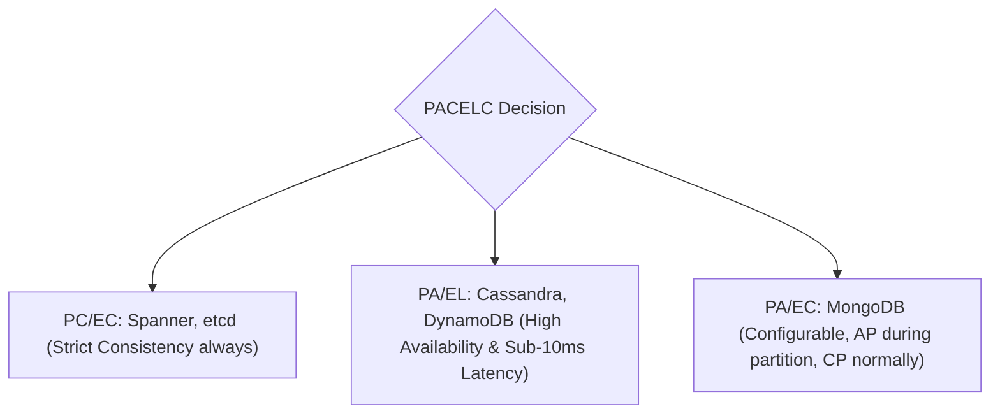

# CAP & PACELC Theorems in Practice

The **CAP Theorem** and **PACELC Theorem** are the fundamental trade-off laws governing distributed data store design.

---

## 1. The CAP Theorem (Brewer / Gilbert & Lynch)

In an asynchronous network, a distributed system can guarantee at most **two out of three** properties:
- **Consistency ($C$)**: Every read receives the most recent write or an error (Linearizability).
- **Availability ($A$)**: Every non-failing node returns a non-error response for every request (no guarantee of latest data).
- **Partition Tolerance ($P$)**: The system continues to operate despite arbitrary packet drops or network partitions.

$$\text{Since Network Partitions } (P) \text{ are physical realities, you must choose between } \mathbf{CP} \text{ and } \mathbf{AP}.$$

---

## 2. The PACELC Theorem (Daniel Abadi)

CAP only describes behavior *during a network partition*. The **PACELC Theorem** extends CAP to explain behavior *during normal operation*:

$$\text{If Partition } (\mathbf{P}) \implies \text{Trade } \mathbf{A} \text{ vs } \mathbf{C}; \quad \mathbf{Else } (\mathbf{E}) \implies \text{Trade } \mathbf{L} \text{ vs } \mathbf{C}$$

