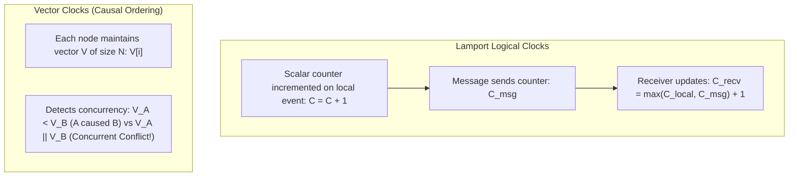

# Time, Clocks & Distributed Ordering

In distributed systems, physical time is fundamentally unreliable due to quartz crystal drift, network jitter, and NTP synchronization steps.

---

## 1. Why Physical Wall-Clock Time Fails

1. **Clock Drift**: Unsynchronized server clocks drift by several milliseconds to seconds per day.
2. **NTP Step Adjustments**: Network Time Protocol (NTP) periodically jumps time backwards or forwards, causing negative duration intervals ($\Delta t < 0$) and breaking lock leases.
3. **The Danger of Last-Write-Wins (LWW)**: Using `System.currentTimeMillis()` for conflict resolution silently overwrites newer updates with stale ones if clock skew exceeds the write interval.

---

## 2. Logical Clocks & Vector Clocks

---

## 3. Google TrueTime & Bounded Uncertainty ($\epsilon$)

Google Spanner solves distributed physical time using **TrueTime**: hardware GPS receivers and atomic clocks in every datacenter. TrueTime represents time not as a single number, but as an interval:

$$\text{TrueTime.now}() = [t_{\text{earliest}}, t_{\text{latest}}] \quad \text{where } \epsilon = \frac{t_{\text{latest}} - t_{\text{earliest}}}{2} \le 7\text{ms}$$

- **Commit Wait Protocol**: When committing a transaction, the leader sleeps for $2\epsilon$ ($~14\text{ms}$) before releasing locks, mathematically guaranteeing linearizability across global datacenters.
