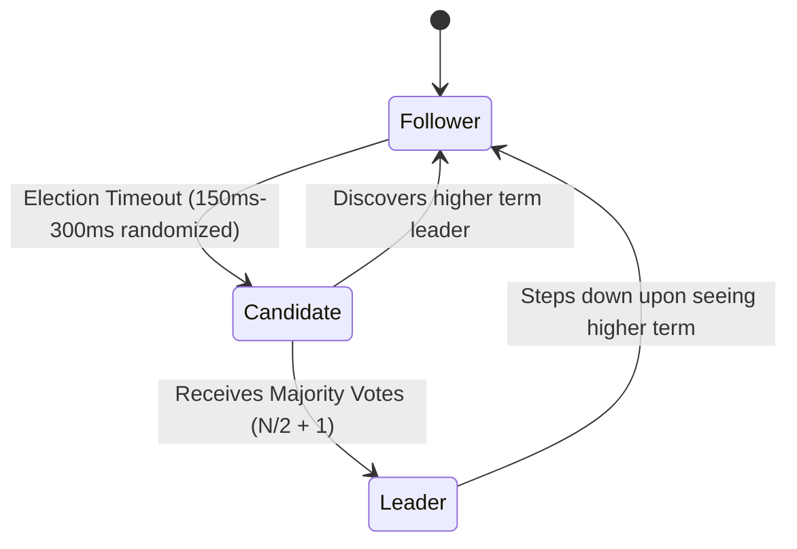
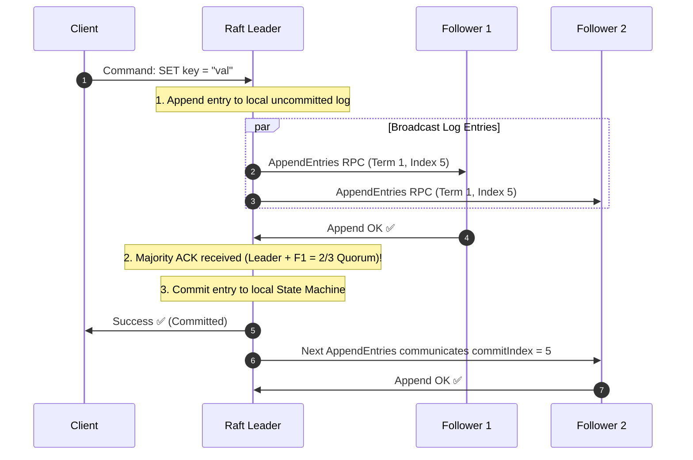

# Distributed Consensus (Paxos, Raft & Zab)

Consensus is the problem of getting a cluster of distributed nodes to agree on a single data value or sequence of state machine operations, even when some nodes crash or messages are lost.

---

## 1. The Raft Consensus Algorithm

Raft decomposes consensus into three independent sub-problems: **Leader Election**, **Log Replication**, and **Safety**.

---

## 2. Raft Quorum Log Replication Workflow

---

## 3. Epoch Generation & Fencing Tokens

To prevent an old, partitioned leader (zombie leader) from executing writes after a new leader has been elected:
- Every election increments an **Epoch / Term Number**.
- Storage backends reject any write tagged with an epoch lower than the highest seen epoch (Fencing Token pattern).
