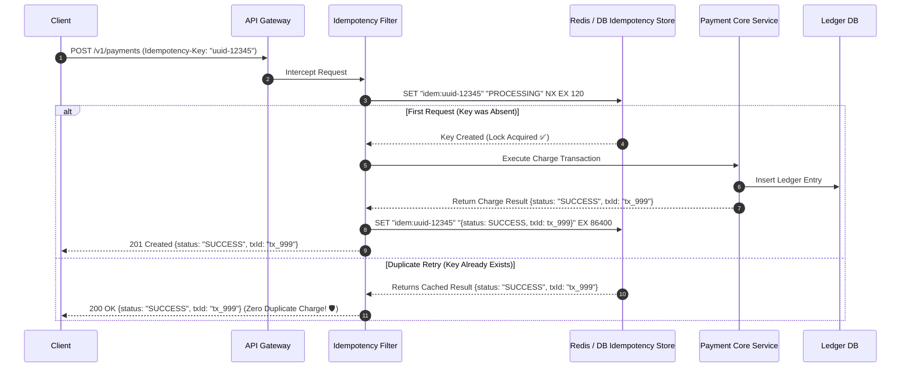

# Idempotency & Exactly-Once Processing

In distributed systems communicating over unreliable networks, true physical "exactly-once transmission" is impossible. Instead, systems achieve **exactly-once processing semantics** by combining **At-Least-Once Delivery** with **Idempotency**.

---

## 1. The Core Equation of Distributed Reliability

$$\text{At-Least-Once Delivery (Retries)} + \text{Idempotent Consumer (Deduplication)} \iff \mathbf{Exactly\text{-}Once\text{ Semantics}}$$

---

## 2. The Idempotency Key Architecture

---

## 3. Distributed Transactions: Two-Phase Commit (2PC) vs Saga

- **Two-Phase Commit (2PC)**: Synchronous, blocking distributed transaction with a coordinator. If the coordinator crashes mid-commit, all nodes remain locked indefinitely. Not suitable for microservices.
- **Saga Pattern**: Sequence of local transactions where each step publishes an event triggering the next step. If a step fails, the Saga executes **compensating transactions** in reverse order to rollback state.
