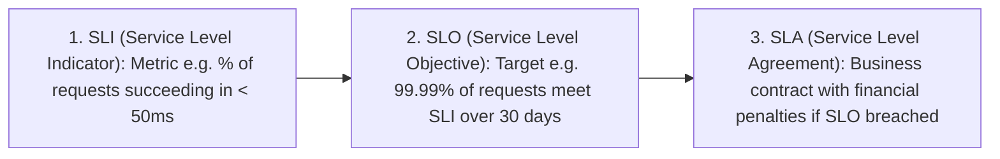

# Availability in Distributed Systems

Availability is the probability that a system is operational and accessible to perform its required functions at any given instant in time.

---

## 1. The Mathematics of "Nines"

Availability is mathematically quantified by the percentage of time a system is fully operational over a one-year period:

$$\text{Availability} = \frac{\text{Uptime}}{\text{Uptime} + \text{Downtime}} = \frac{\text{MTBF}}{\text{MTBF} + \text{MTTR}}$$

- **MTBF (Mean Time Between Failures)**: Average time between independent system outage events.
- **MTTR (Mean Time to Recover)**: Average time taken by engineering runbooks or automated failovers to restore healthy service.

| Availability Level | Downtime per Year | Downtime per Month | Downtime per Day | Typical System Domain |
|---|---|---|---|---|
| **99% (Two Nines)** | 3.65 days | 7.30 hours | 14.40 minutes | Internal batch jobs, non-critical dev tools |
| **99.9% (Three Nines)** | 8.76 hours | 43.80 minutes | 1.44 minutes | Standard SaaS web applications |
| **99.99% (Four Nines)** | 52.60 minutes | 4.38 minutes | 8.64 seconds | Tier-1 E-commerce, Social Media, APIs |
| **99.999% (Five Nines)** | 5.26 minutes | 26.30 seconds | 864 milliseconds | Core Telecom, Payment Gateways, Cloud IaaS |

---

## 2. SLA vs SLO vs SLI



---

## 3. High Availability (HA) Architectural Patterns

```mermaid
flowchart TD
    subgraph MultiAZ["Multi-AZ Active-Active Deployment"]
        Client[Client Request] --> GeoDNS[Route 53 GeoDNS]
        GeoDNS --> LB1[LB in AZ-1 (US-East-1a)]
        GeoDNS --> LB2[LB in AZ-2 (US-East-1b)]
        LB1 --> App1[App Instance 1]
        LB2 --> App2[App Instance 2]
        App1 --> MasterDB[(PostgreSQL Primary in AZ-1)]
        App2 --> MasterDB
        MasterDB == Synchronous Replication ==> StandbyDB[(PostgreSQL Standby in AZ-2)]
    end
```

- **Eliminate All Single Points of Failure (SPOFs)**: Every tier (Load Balancer, API Gateway, App Cluster, Database) must have at least $N+1$ redundancy across independent failure domains (Availability Zones).
- **Automated Health Checks & Health Draining**: Load balancers must poll `/health` endpoints every 5 seconds and automatically drain traffic away from unhealthy nodes in $< 10\text{ seconds}$.
