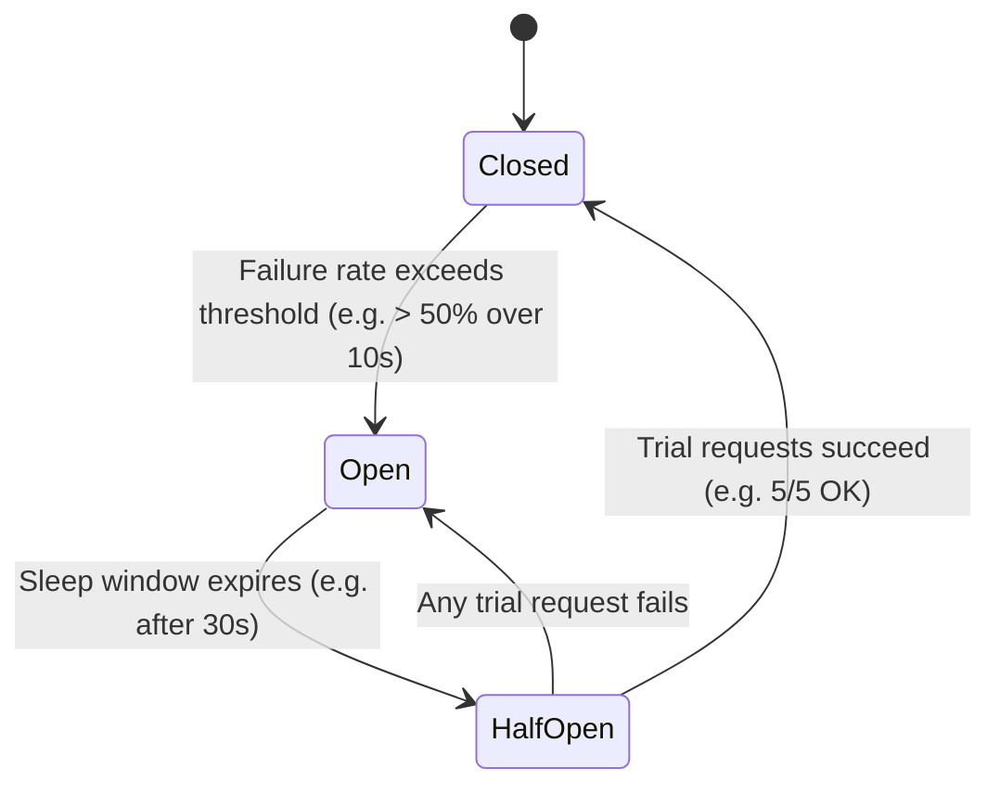

# Reliability & Fault Tolerance

While **availability** measures whether the system is up, **reliability** measures whether the system performs its required operations *correctly* without errors over a specified time interval.

---

## 1. Reliability vs Availability

- A system can be **available** (returns HTTP 200 OK) but **unreliable** (returns corrupted data or stale zero balances).
- A system can be **reliable** (never loses a committed bank transaction) but experience brief planned maintenance windows of low availability.

---

## 2. Defensive Resiliency Architecture

```mermaid
flowchart TD
    subgraph IngressProtection["1. Ingress Protection"]
        Client[Client] --> RateLimit[Distributed Rate Limiter (Token Bucket)]
    end

    subgraph ServiceResilience["2. Service-to-Service Resilience"]
        RateLimit --> App[App Service]
        App --> CB[Circuit Breaker (Resilience4j)]
        CB --> Downstream[Downstream Inventory Service]
    end

    subgraph FailureIsolation["3. Failure Isolation & Fallback"]
        CB -- On 50% Failures Open Circuit --> FallbackCache[(Stale Fallback Cache)]
        App --> RetryEngine[Jittered Exponential Backoff Engine]
        RetryEngine --> DLQ[(Dead Letter Queue)]
    end
```

---

## 3. The Circuit Breaker State Machine



- **Closed State**: Normal operation. Requests flow directly through to downstream services.
- **Open State**: Immediate fast-failure! Requests are short-circuited instantly without calling the failing downstream service, protecting client threads from blocking.
- **Half-Open State**: A limited number of probe requests are allowed through to test downstream health before fully closing the circuit.
