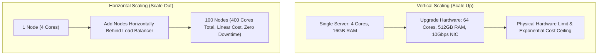
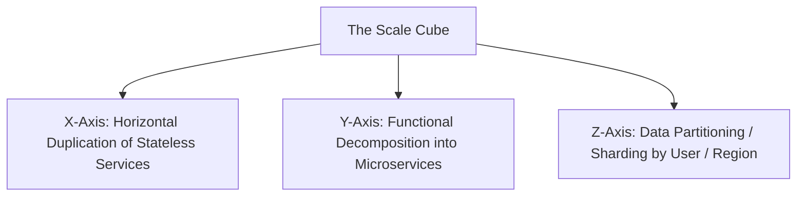

# Scalability in Distributed Systems

Scalability is the ability of a system to handle linearly growing workloads gracefully by adding computational, storage, or network resources.

---

## 1. Vertical Scaling (Scale Up) vs Horizontal Scaling (Scale Out)

---

## 2. The 3 Scaling Dimensions: The Scale Cube (Abbott & Fisher)

1. **X-Axis Scaling (Duplication)**: Run $N$ identical stateless clones of an application behind an L7 load balancer.
2. **Y-Axis Scaling (Decomposition)**: Split a large monolithic code base into distinct bounded services (`User Service`, `Order Service`, `Payment Service`).
3. **Z-Axis Scaling (Data Sharding)**: Partition state across independent database clusters by customer ID or geographic country (`US Shard`, `EU Shard`, `APAC Shard`).
