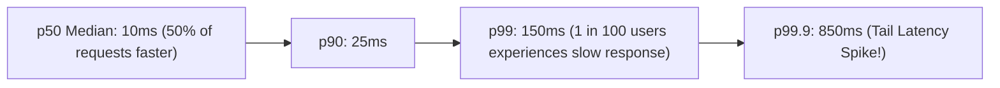

# Performance & Latency

Performance in distributed systems is defined by **throughput** and **latency percentiles**.

---

## 1. Why Averages Lie: The Tail Latency Problem

Never evaluate distributed system performance using average (mean) latency. Outliers and long-tail delays dominate user experience:

If a web page makes 100 internal microservice calls to render, the probability that a user experiences the **p99 tail latency** is:

$$P(\text{at least one call } \ge \text{p}99) = 1 - (1 - 0.01)^{100} = 1 - 0.366 = \mathbf{63.4\%}$$

Nearly **two-thirds of your users** will experience the worst-case tail latency!

---

## 2. Latency Numbers Every Distributed Systems Engineer Must Know

| Operation | Latency | Scaled Comparison (1 CPU Cycle = 1 sec) |
|---|---|---|
| **L1 CPU Cache Reference** | $0.5\text{ ns}$ | $1\text{ second}$ |
| **L2 CPU Cache Reference** | $7\text{ ns}$ | $14\text{ seconds}$ |
| **Main Memory (RAM) Access** | $100\text{ ns}$ | $3.3\text{ minutes}$ |
| **Solid-State Drive (NVMe SSD) Read** | $100\text{ }\mu\text{s}$ | $2.3\text{ days}$ |
| **Rotational HDD Seek** | $10\text{ ms}$ | $7.7\text{ months}$ |
| **Same-Datacenter Network Round-Trip (RTT)**| $0.5\text{ ms}$ | $5.8\text{ days}$ |
| **Cross-Continent Network RTT (SF to NYC)** | $40\text{ ms}$ | $2.5\text{ years}$ |
| **Cross-Ocean Network RTT (SF to Tokyo)** | $150\text{ ms}$ | $9.5\text{ years}$ |
