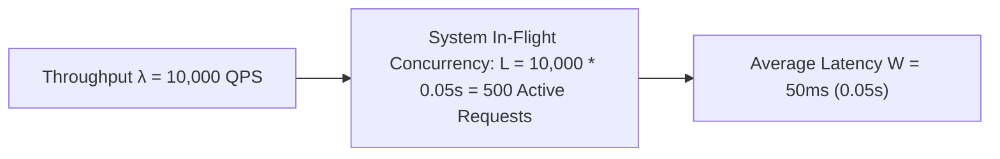

# Throughput & Bandwidth

Throughput is the volume of work a system completes in a given unit of time, measured in **Queries Per Second (QPS)**, **Transactions Per Second (TPS)**, or **Data Bandwidth (MB/s or Gbps)**.

---

## 1. Little's Law

The foundational mathematical law connecting throughput, latency, and concurrency in queuing systems:

$$L = \lambda \times W$$

- $L$ = Average number of concurrent requests in the system.
- $\lambda$ = Arrival rate / Throughput (Requests Per Second).
- $W$ = Average latency / Service time per request (seconds).

---

## 2. Ingress vs Egress Bandwidth Sizing

- **Ingress Bandwidth**: Network traffic entering your datacenter (e.g. raw video uploads, client API payloads).
- **Egress Bandwidth**: Network traffic leaving your datacenter to end users (e.g. streaming 4K video, downloading images).
- **Egress Cost**: Cloud providers (AWS/GCP) charge heavily for outbound network egress ($0.05 - $0.09 / GB), making CDNs and client caching critical for cost reduction.
