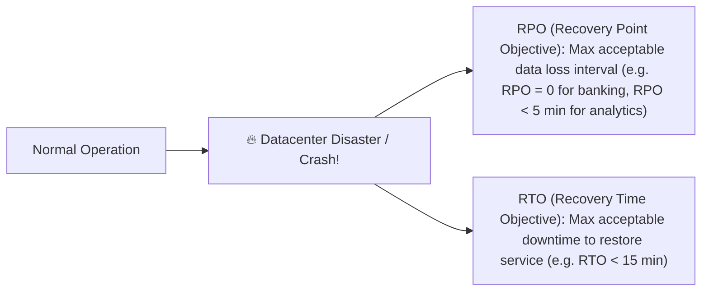

# Durability & Data Loss Prevention

Durability is the guarantee that once a transaction or state mutation is committed and acknowledged to the client, the data will survive permanent hardware crashes, power outages, and datacenter disasters.

---

## 1. RPO vs RTO

---

## 2. Multi-Tier Durability Strategies

1. **Write-Ahead Logging (WAL)**: Synchronous disk flush (`fsync`) before acknowledging the client.
2. **Synchronous Multi-AZ Replication**: Write acknowledged only after replication to at least 2 independent power/cooling failure domains.
3. **Erasure Coding in Object Storage (e.g. Reed-Solomon in S3)**: Breaks data into $K$ data chunks and $M$ parity chunks. The object can survive the loss of any $M$ arbitrary disk drives with only ~30% storage overhead compared to 3x full replication.
