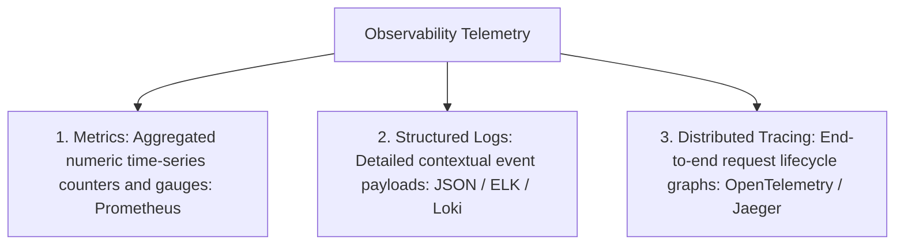
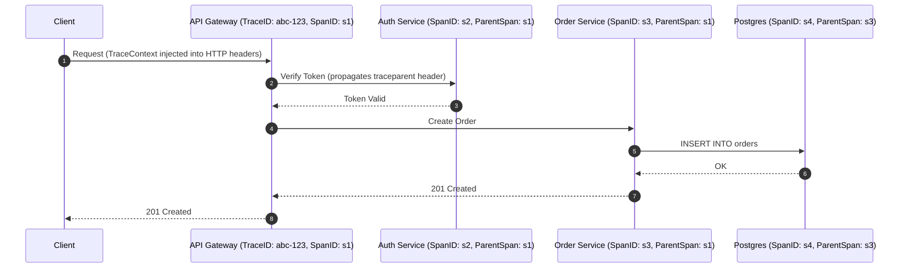

# Observability: Metrics, Logs & Distributed Tracing

Observability is the degree to which you can infer the internal state and root causes of anomalies in a distributed system based solely on its external telemetry outputs.

---

## 1. The 3 Pillars of Observability

---

## 2. The RED Method for Microservices

For every microservice endpoint, track the **RED** metrics:
- **R (Rate)**: Requests per second received by the service.
- **E (Errors)**: Number of requests failing per second (HTTP 5xx / exceptions).
- **D (Duration)**: Time taken to process each request (p50, p95, p99 latency histograms).

---

## 3. Distributed Tracing Architecture

