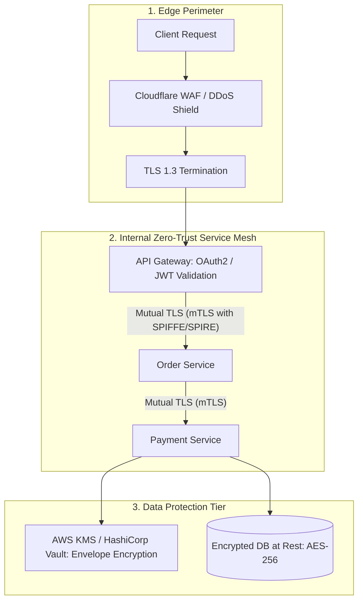

# Security & Compliance in System Design

Security must be an integrated architectural invariant rather than an afterthought attached to completed designs.

---

## 1. Zero Trust Architecture

---

## 2. Core Security Checkpoints for Interviews

1. **Authentication & Authorization**: OAuth2.0 with short-lived asymmetric JWTs (`RS256`), Role-Based Access Control (RBAC).
2. **Encryption in Transit**: Strict TLS 1.3 on external endpoints; mTLS with automated certificate rotation between internal microservices.
3. **Encryption at Rest**: AES-256 envelope encryption with customer-managed keys in Hardware Security Modules (AWS KMS).
4. **Data Sanitization & Injection Prevention**: Parameterized prepared SQL statements, input payload validation schemas.
5. **Rate Limiting & DDoS Shielding**: Token Bucket rate limiting at API Gateway; Anycast BGP scrubbing at CDN edge.
