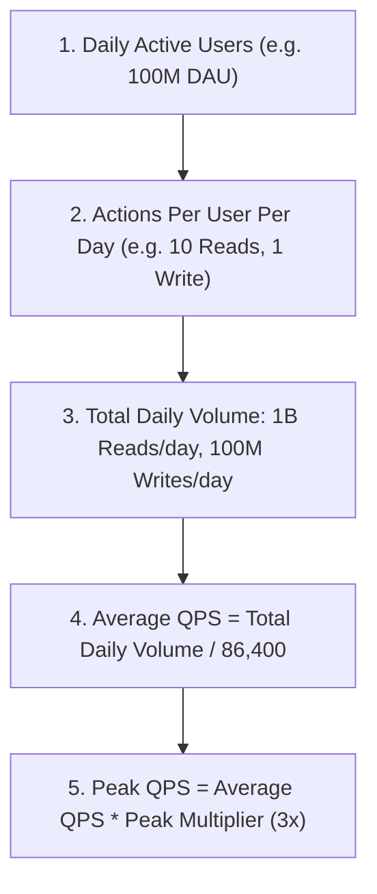

# Traffic & QPS Estimation

Estimating traffic establishes the computational load required for application clusters, caches, and database engines.

---

## 1. Step-by-Step QPS Calculation Workflow

---

## 2. Formulas & Calculations

### A. Average QPS
$$\text{Average Read QPS} = \frac{\text{DAU} \times \text{Reads per user}}{86,400}$$

$$\text{Average Write QPS} = \frac{\text{DAU} \times \text{Writes per user}}{86,400}$$

### B. Peak QPS
Traffic is not distributed uniformly over 24 hours. Traffic peaks during evening hours or viral events. Always multiply average QPS by a **Peak Multiplier** ($2\times \text{ to } 5\times$, standard is $3\times$):

$$\text{Peak QPS} = \text{Average QPS} \times 3$$

---

## 3. Worked Interview Example: Social Media Platform (Twitter / X)

- **Given Constraints**:
  - $300\text{M}$ Daily Active Users (DAU).
  - Each user views their home timeline $5$ times/day.
  - $10\%$ of users create $2$ tweets/day.
- **Calculations**:
  - **Daily Reads**: $300\text{M} \times 5 = 1.5\text{ Billion timeline reads/day}$.
  - **Daily Writes**: $300\text{M} \times 0.10 \times 2 = 60\text{ Million tweets/day}$.
  - **Average Read QPS**: $\frac{1.5 \times 10^9}{86,400} \approx \mathbf{17,360\text{ QPS}}$.
  - **Peak Read QPS ($3\times$)**: $17,360 \times 3 \approx \mathbf{52,000\text{ QPS}}$.
  - **Average Write QPS**: $\frac{60 \times 10^6}{86,400} \approx \mathbf{694\text{ QPS}}$.
  - **Peak Write QPS ($3\times$)**: $694 \times 3 \approx \mathbf{2,100\text{ QPS}}$.
