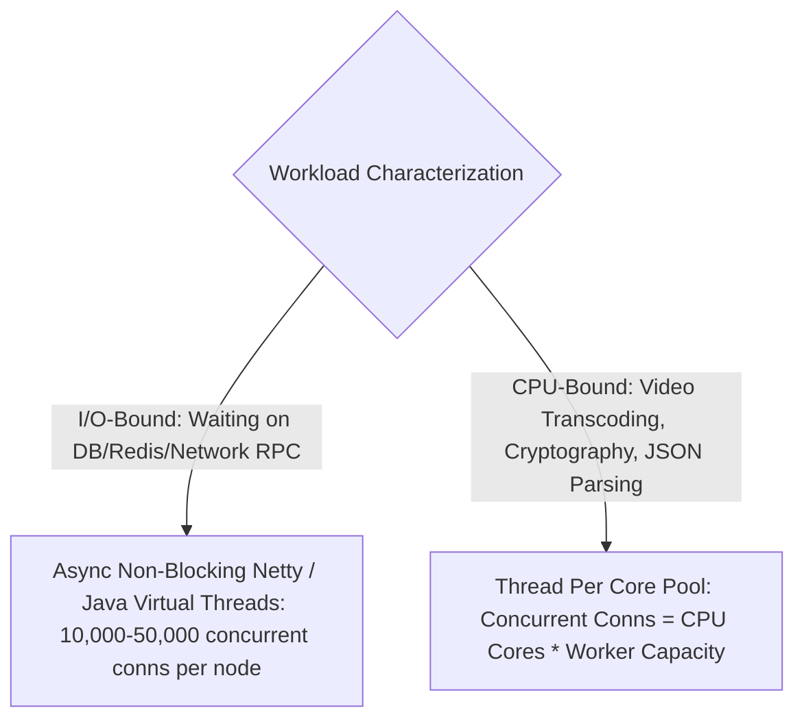

# Server Cluster & CPU Core Estimation

Estimating the number of application server instances ensures your compute tier is neither under-provisioned (causing 503 Outages) nor over-provisioned (wasting millions in cloud spend).

---

## 1. CPU-Bound vs I/O-Bound Workload Math

---

## 2. Server Cluster Sizing Formula

$$\text{Total Servers Needed} = \frac{\text{Peak QPS}}{\text{Throughput Capacity Per Server Instance}} \times (1 + \text{Autoscaling Headroom } 0.30)$$

- **Rule of Thumb for Sizing Stateless Java / Spring Boot Microservices**:
  - Standard container instance (4 vCPU, 16GB RAM) handling lightweight JSON CRUD: **$1,000\text{ to }2,500\text{ QPS per instance}$**.
  - Heavy compute (image resizing, token embedding): **$50\text{ to }200\text{ QPS per instance}$**.

---

## 3. Worked Interview Example: Ride-Hailing Gateway (Uber)

- **Assumptions**:
  - Peak Inbound QPS = $100,000\text{ QPS}$.
  - Target service: Stateless API Gateway (Auth token verification + rate limit check).
  - Single 8-vCPU gateway instance handles $5,000\text{ QPS}$.
- **Calculations**:
  - **Base Servers**: $\frac{100,000}{5,000} = 20\text{ Instances}$.
  - **With 30% Headroom for Sudden Traffic Spikes**: $20 \times 1.30 = \mathbf{26\text{ Instances}}$ distributed across 3 Availability Zones (9 instances per AZ).
