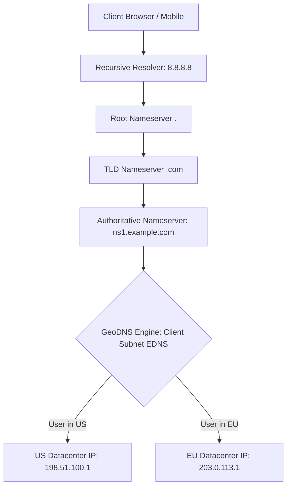

# Building Block 01: DNS (Domain Name System & GeoDNS)

> **Module**: `06-building-blocks`
> **Reusability Category**: Ingress / Storage / Messaging / Coordination / Reliability / Telemetry

---

## 1. Problem
Clients know human-readable hostnames (e.g., api.example.com) but network routers require IP addresses. Without DNS, global traffic distribution, datacenter failover, and anycast routing are impossible.

## 2. Requirements
- **Functional Requirements**: Provide robust, highly available, low-latency primitives for client and microservice workloads.
- **Non-Functional Requirements**:
  - **Availability**: $99.999\%$ uptime SLA (Five Nines).
  - **Latency**: $\text{p}99 < 5\text{ms}$ in-memory / $\text{p}99 < 50\text{ms}$ network hop.
  - **Scalability**: Linearly scale to millions of concurrent requests.

## 3. Why It Exists
Hardcoding IP addresses in client software causes catastrophic failure when servers migrate, scale, or fail. DNS acts as a globally distributed, hierarchical, cached lookup table decoupling domain names from physical IP addresses.

## 4. Mental Model
The global phonebook of the Internet, organized as a distributed tree hierarchy with aggressive multi-layer caching.

## 5. Core Concepts
Root nameservers (.), Top-Level Domain (TLD) servers (.com, .org), Authoritative Nameservers, Recursive Resolvers, Time-To-Live (TTL), A/AAAA records, CNAME records, Anycast BGP routing, GeoDNS.

## 6. Architecture

## 7. Request/Data Flow
1. Client checks local browser and OS cache. 2. If missed, queries Recursive Resolver. 3. Resolver queries Root -> TLD -> Authoritative NS. 4. Authoritative NS inspects EDNS Client Subnet and returns closest Regional VIP with TTL.

## 8. Data Model
DNS Resource Records: `name (STRING)`, `type (A/AAAA/CNAME/TXT/MX)`, `value (IP/Host)`, `ttl (INT32)`. Zone files stored in memory on authoritative BIND/PowerDNS servers.

## 9. API Design
DNS operates over UDP port 53 (and TCP for payloads > 512 bytes / DNSSEC). DNS-over-HTTPS (DoH) uses standard REST JSON payloads.

## 10. Algorithms
Anycast BGP Routing (announcing the same IP prefix from multiple global datacenters), Consistent Geohash lookups for GeoDNS.

## 11. Scaling
Scale out via Anycast IP routing across thousands of edge Points of Presence (POPs) globally. Billions of QPS handled via tiered recursive caching.

## 12. Partitioning
Zone-based partitioning across authoritative clusters; geographic sharding based on client IP prefix.

## 13. Replication
Primary-Secondary zone transfers via AXFR/IXFR protocols; redundant anycast server instances across global datacenters.

## 14. Consistency
Eventual consistency governed by TTL. Propagation of DNS record mutations takes between seconds and hours depending on configured TTL.

## 15. Failure Scenarios
Authoritative server crash, ISP resolver poisoning, DDoS amplification attacks, stale DNS cache during emergency failovers.

## 16. Recovery
Secondary authoritative failover, Anycast BGP automatic route withdrawal, short TTLs (60s) for critical ingress endpoints.

## 17. Observability
Query volume (QPS), cache hit/miss ratio at resolver, query resolution latency (p99 < 20ms), NXDOMAIN error spikes.

## 18. Security
DNSSEC (cryptographic signing of DNS records), DNS over HTTPS (DoH) / DNS over TLS (DoT) to prevent ISP spoofing.

## 19. Performance
EDNS Client Subnet (ECS) optimization, UDP single-packet round trips (0-RTT), memory-mapped zone caches.

## 20. Trade-offs
Low TTL (fast failover, high query load/cost) vs High TTL (slow failover, near-zero resolver query load).

## 21. When to Use
Global load balancing, multi-region routing, initial service bootstrap, external traffic ingress.

## 22. When NOT to Use
Internal microservice-to-microservice dynamic discovery with sub-second churn (use Consul/Eureka instead).

## 23. Implementation Strategy
Deploy Authoritative DNS on Route 53 or Cloudflare with health-checked failover records and GeoProximity routing.

## 24. Practical Exercise
Simulate a regional outage: configure Route 53 health check alarms to withdraw US-East IP and route 100% traffic to US-West.

## 25. Interview Questions
1. What is the difference between A, CNAME, and ALIAS records? 2. Why is DNS not suitable for fast microservice load balancing? 3. How does Anycast BGP routing work?

## 26. Common Mistakes
Setting TTL to 24 hours on production endpoints, preventing rapid rollback during a bad deployment.

## 27. Quick Revision
Hierarchical lookup -> Aggressive caching -> Anycast routing -> GeoDNS steering -> TTL controls propagation delay.

## 28. Related Building Blocks
`BB-02` (Load Balancer), `BB-05` (CDN), `BB-19` (API Gateway)

## 29. Related Case Studies
`CS-01` (YouTube / Netflix), `CS-05` (Uber), `CS-08` (Instagram)
