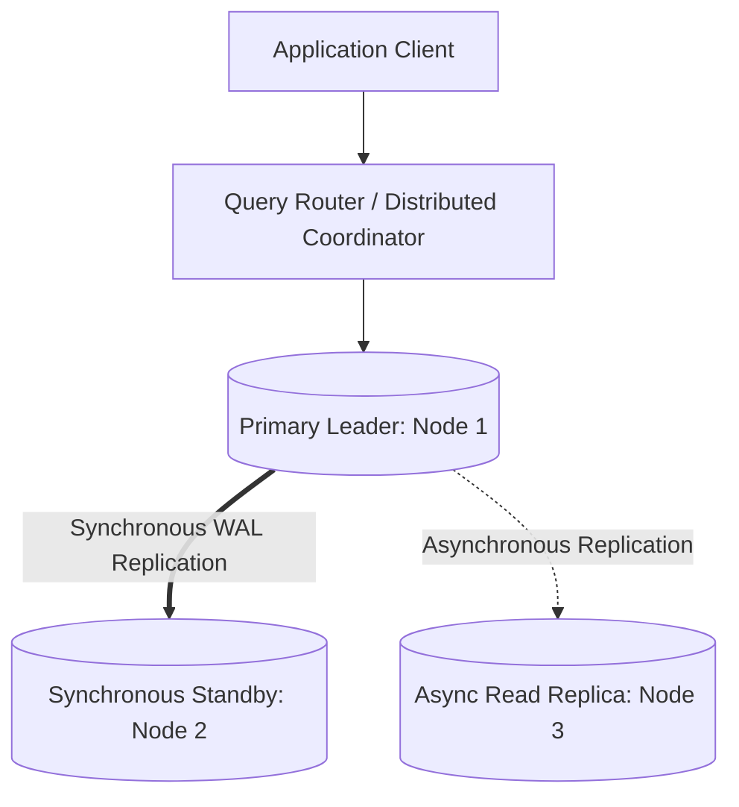

# Building Block 03: Distributed Database (Relational, SQL & ACID)

> **Module**: `06-building-blocks`
> **Reusability Category**: Ingress / Storage / Messaging / Coordination / Reliability / Telemetry

---

## 1. Problem
Applications require structured storage guaranteeing ACID transactional properties (Atomicity, Consistency, Isolation, Durability) across massive data sets exceeding single-server disk and write IOPS limits.

## 2. Requirements
- **Functional Requirements**: Provide robust, highly available, low-latency primitives for client and microservice workloads.
- **Non-Functional Requirements**:
  - **Availability**: $99.999\%$ uptime SLA (Five Nines).
  - **Latency**: $\text{p}99 < 5\text{ms}$ in-memory / $\text{p}99 < 50\text{ms}$ network hop.
  - **Scalability**: Linearly scale to millions of concurrent requests.

## 3. Why It Exists
Traditional single-node RDBMS (MySQL/PostgreSQL) hit hard vertical scaling limits. Distributed relational engines shard and replicate structured data while preserving relational query semantics.

## 4. Mental Model
A globally coordinated ledger split into partitioned books, where multiple scribes synchronize writes via formal consensus protocols.

## 5. Core Concepts
ACID transactions, Write-Ahead Logging (WAL), B-Trees vs LSM-Trees, MVCC (Multi-Version Concurrency Control), Read/Write splitting, Sharding, Two-Phase Commit (2PC), Google Spanner TrueTime.

## 6. Architecture

## 7. Request/Data Flow
1. Client begins transaction. 2. Coordinator acquires row locks / MVCC read snapshot. 3. Writes appended sequentially to WAL. 4. State replicated to quorum replicas. 5. Changes committed to B-Tree pages and acknowledged.

## 8. Data Model
Relational Tables, primary/foreign keys, B+ Tree index pages on disk, Write-Ahead Log segments.

## 9. API Design
SQL (Structured Query Language): ANSI SQL, ACID transaction primitives (`BEGIN`, `COMMIT`, `ROLLBACK`), distributed query plans.

## 10. Algorithms
Two-Phase Locking (2PL), Multi-Version Concurrency Control (MVCC), Raft / Paxos consensus for distributed WAL.

## 11. Scaling
Read scale via Read Replicas; Write scale via horizontal table sharding by Partition Key (e.g. Citus, CockroachDB, Spanner).

## 12. Partitioning
Hash or Range-based sharding across database nodes; co-locating related entity tables on identical shards to enable local joins.

## 13. Replication
Single-Leader synchronous replication (zero RPO) or Multi-AZ asynchronous replication (low write latency).

## 14. Consistency
Configurable isolation levels: Read Committed, Repeatable Read, Serializable (Linearizable via Spanner TrueTime).

## 15. Failure Scenarios
Primary node crash (Raft election failover), replication lag spikes on followers, distributed deadlock in 2PC.

## 16. Recovery
Automated leader failover via Patroni/Raft, point-in-time recovery (PITR) via continuous WAL archiving to S3.

## 17. Observability
Transaction throughput (TPS), query latency histograms, lock wait time, replication lag (bytes/seconds), buffer pool hit ratio.

## 18. Security
Encryption at rest (AES-256), TLS encrypted connections, Column-level encryption for PII, strict RBAC database roles.

## 19. Performance
B+ Tree index optimization, connection pooling with PgBouncer, covering indexes, avoiding `SELECT *`.

## 20. Trade-offs
Strict Serializability (high latency, zero anomalies) vs Read Committed (low latency, phantom read anomalies).

## 21. When to Use
Financial transactions, e-commerce orders, user identity accounts, complex relational entity graphs.

## 22. When NOT to Use
High-throughput raw append-only time-series metrics ($500k\text{ writes/sec}$) where wide-column NoSQL is superior.

## 23. Implementation Strategy
Use PostgreSQL with PgBouncer connection pooling, primary-standby streaming replication, and read-replica routing in Spring Boot.

## 24. Practical Exercise
Set up PostgreSQL master-replica with Testcontainers, execute a concurrent transfer transaction, and verify ACID isolation.

## 25. Interview Questions
1. Explain how MVCC eliminates read-write lock contention. 2. What are the 4 standard ANSI SQL isolation levels? 3. How does Google Spanner achieve external consistency without 2PC deadlocks?

## 26. Common Mistakes
Using distributed transactions (2PC) across dozens of microservices instead of event-driven Sagas (causes severe latency collapse).

## 27. Quick Revision
Relational ACID = Strong invariants; WAL = Durability; MVCC = Non-blocking reads; Sharding + Replication = Scale.

## 28. Related Building Blocks
`BB-04` (Key-Value Store), `BB-06` (Sequencer), `BB-36` (Payment Idempotency)

## 29. Related Case Studies
`CS-15` (Payment Gateway / Stripe), `CS-02` (Quora), `CS-09` (TinyURL)
