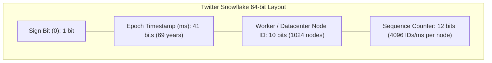

# Building Block 06: Distributed ID Generator / Sequencer

> **Module**: `06-building-blocks`
> **Reusability Category**: Ingress / Storage / Messaging / Coordination / Reliability / Telemetry

---

## 1. Problem
Distributed databases require unique, 64-bit, roughly time-ordered IDs for primary keys across billions of records without creating a central database bottleneck or lock contention.

## 2. Requirements
- **Functional Requirements**: Provide robust, highly available, low-latency primitives for client and microservice workloads.
- **Non-Functional Requirements**:
  - **Availability**: $99.999\%$ uptime SLA (Five Nines).
  - **Latency**: $\text{p}99 < 5\text{ms}$ in-memory / $\text{p}99 < 50\text{ms}$ network hop.
  - **Scalability**: Linearly scale to millions of concurrent requests.

## 3. Why It Exists
Standard auto-increment IDs (`AUTO_INCREMENT`) require a centralized database lock, limiting throughput to a few thousand IDs/sec. UUIDv4 is 128-bit, non-sequential, and destroys B-Tree index performance due to random disk insertion.

## 4. Mental Model
A fleet of autonomous stamping machines, each stamping unique timestamps and machine IDs onto serial badges.

## 5. Core Concepts
Twitter Snowflake format, 64-bit integer structure (1 sign bit, 41 timestamp bits, 10 worker ID bits, 12 sequence bits), Clock Drift handling, Ticket Servers, UUIDv7.

## 6. Architecture

## 7. Request/Data Flow
1. Node receives `generateId()` call. 2. Reads current timestamp in ms. 3. If same millisecond, increments sequence counter (0 to 4095). 4. If sequence overflows, waits for next ms. 5. Combines bits via bitwise OR: `(time << 22) | (worker << 12) | seq`.

## 8. Data Model
64-bit signed integer (`int64` / `Long`).

## 9. API Design
gRPC endpoint: `GenerateId(ServiceRequest) returns (UniqueIdResponse { int64 id = 1; })` or local in-process library call.

## 10. Algorithms
Bitwise manipulation: `(ts - epoch) << 22 | (workerId << 12) | sequence`.

## 11. Scaling
Zero coordination required between generator nodes. Up to $1024$ nodes generating $4.096\text{M IDs/sec per node} = 4.19\text{ Billion IDs/sec total}$.

## 12. Partitioning
Partitioned by Worker ID assigned dynamically via Zookeeper / etcd leases.

## 13. Replication
Stateless local worker node execution; zero inter-node replication required.

## 14. Consistency
Strictly monotonic within a single worker node; roughly time-ordered globally.

## 15. Failure Scenarios
Clock drift (NTP backward step): generator rejects generation or pauses until physical clock catches up.

## 16. Recovery
Worker ID lease renewal via Zookeeper; automated worker ID reassignment on crash.

## 17. Observability
ID generation rate (QPS), sequence overflow wait count, clock drift backwards jump frequency.

## 18. Security
IDs are predictable (roughly sequential); never expose raw sequential IDs as public authorization tokens without obfuscation.

## 19. Performance
Zero network overhead when embedded as an in-process library inside application microservices ($< 50\text{ nanoseconds}$ per ID).

## 20. Trade-offs
64-bit roughly time-ordered (Snowflake) vs 128-bit truly random (UUIDv4) vs Fully coordinated sequential (Flickr Ticket Server).

## 21. When to Use
Primary keys in distributed databases (PostgreSQL, Cassandra), message IDs in Kafka, tweet/post IDs, order IDs.

## 22. When NOT to Use
Purely single-node monoliths where database native sequences suffice.

## 23. Implementation Strategy
Implement an in-memory thread-safe Java Snowflake generator with synchronized block and atomic worker ID registration.

## 24. Practical Exercise
Write a multithreaded Java benchmark testing Snowflake ID generation across 16 threads generating 10M IDs with zero collisions.

## 25. Interview Questions
1. Explain the 64-bit layout of Twitter Snowflake. 2. How do you handle physical clock drift in Snowflake? 3. Why does UUIDv4 degrade B-Tree index performance?

## 26. Common Mistakes
Allowing the generator to continue issuing IDs when physical clock drifts backwards (causes duplicate IDs).

## 27. Quick Revision
Snowflake: 41-bit time + 10-bit worker + 12-bit sequence = 64-bit unique, k-ordered, 4M IDs/ms capacity.

## 28. Related Building Blocks
`BB-03` (RDBMS), `BB-04` (KV Store), `BB-24` (Unique ID Generator)

## 29. Related Case Studies
`CS-06` (Twitter / X), `CS-09` (TinyURL), `CS-15` (Payment Gateway)
