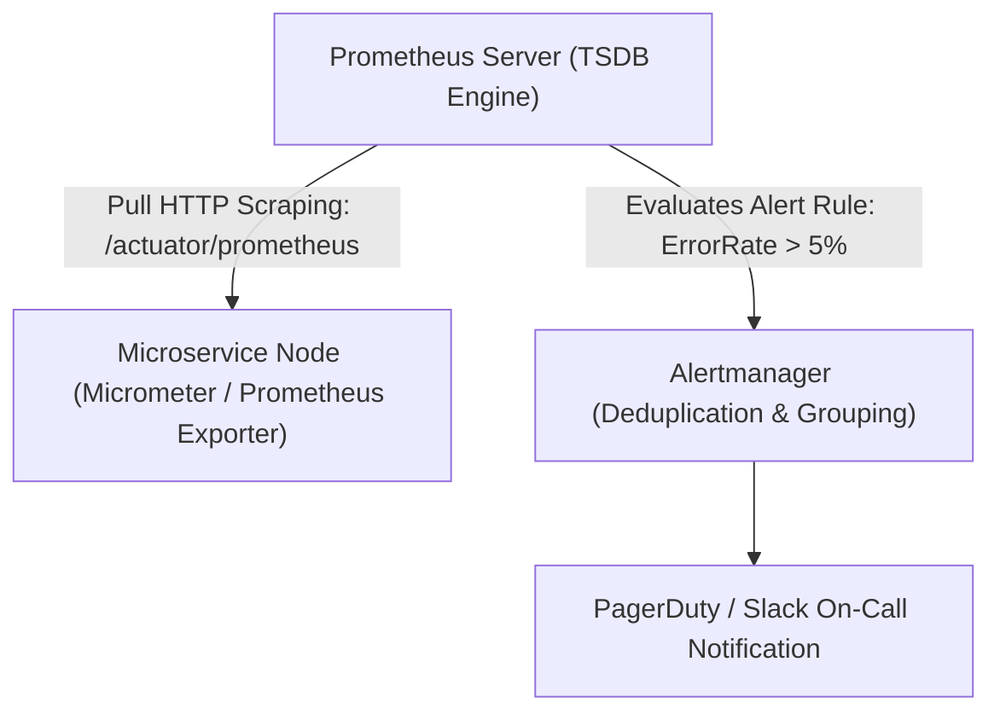

# Building Block 07: Distributed Monitoring & Alerting Engine

> **Module**: `06-building-blocks`
> **Reusability Category**: Ingress / Storage / Messaging / Coordination / Reliability / Telemetry

---

## 1. Problem
Engineers cannot manually track the health, CPU load, error rates, and saturation of thousands of distributed microservice instances and databases.

## 2. Requirements
- **Functional Requirements**: Provide robust, highly available, low-latency primitives for client and microservice workloads.
- **Non-Functional Requirements**:
  - **Availability**: $99.999\%$ uptime SLA (Five Nines).
  - **Latency**: $\text{p}99 < 5\text{ms}$ in-memory / $\text{p}99 < 50\text{ms}$ network hop.
  - **Scalability**: Linearly scale to millions of concurrent requests.

## 3. Why It Exists
Without proactive telemetry and automated threshold alerting, outages go undetected until customers report system downtime.

## 4. Mental Model
An automated control tower continuously collecting vital sensor readings from an entire fleet of airplanes in flight.

## 5. Core Concepts
Pull (Prometheus) vs Push (StatsD/DataDog) metrics collection, Time-Series Database (TSDB), Inverted Index on Metric Labels, PromQL, Alertmanager, PagerDuty integration.

## 6. Architecture

## 7. Request/Data Flow
1. Application exposes `/metrics` endpoint. 2. Prometheus server scrapes metrics every 15s. 3. Appends samples to in-memory chunk buffer and WAL. 4. Flushes chunks to disk. 5. Evaluates alert rules every 15s. 6. Triggers PagerDuty on breach.

## 8. Data Model
Time-Series Data Model: `metric_name{label1=val1, label2=val2} timestamp value (float64)`.

## 9. API Design
Prometheus HTTP API: `GET /api/v1/query?query=rate(http_requests_total[5m])`.

## 10. Algorithms
Double Delta Time Compression (Gorilla TSDB), XOR Float Compression, Label Indexing with Inverted Index.

## 11. Scaling
Federated Prometheus architecture, Thanos / Cortex / Mimir for long-term multi-region storage.

## 12. Partitioning
Metrics sharded by metric name and label hash across TSDB storage nodes.

## 13. Replication
Replicated scraping (two Prometheus instances scrape the same targets independently).

## 14. Consistency
Eventual consistency; metric samples are loss-tolerant time-series points.

## 15. Failure Scenarios
Scrape timeout due to service overload, TSDB disk saturation, High cardinality metric explosion.

## 16. Recovery
Thanos / S3 compaction for historical data; dropping unbounded high-cardinality labels (e.g. `user_id`).

## 17. Observability
Scrape duration, samples ingested per second, TSDB compaction latency, Alert evaluation lag.

## 18. Security
mTLS scraping, API token authentication, network firewall rules restricting metric endpoint access.

## 19. Performance
Gorilla compression shrinks 16-byte time-series samples down to an average of 1.37 bytes.

## 20. Trade-offs
Pull Model (Centralized control, firewall friendly) vs Push Model (Better for short-lived ephemeral batch jobs).

## 21. When to Use
Real-time cluster telemetry, SLO tracking, automated auto-scaling triggers, on-call alerting.

## 22. When NOT to Use
Long-term cold forensic debugging of individual user transaction payloads (use Structured Logs instead).

## 23. Implementation Strategy
Configure Micrometer in Spring Boot Actuator with Prometheus registry and Grafana dashboards.

## 24. Practical Exercise
Deploy Prometheus + Grafana in Docker Compose, configure a threshold alert for HTTP 500 error rates, and trigger an alert.

## 25. Interview Questions
1. Explain the difference between Pull and Push monitoring models. 2. What is high-cardinality label explosion in Prometheus? 3. How does Gorilla TSDB compress floating-point metrics?

## 26. Common Mistakes
Injecting unbounded UUIDs or user IDs into Prometheus metric labels (causes memory OOM collapse).

## 27. Quick Revision
Prometheus scrapes `/metrics` -> TSDB Gorilla compresses time-series -> Alertmanager notifies on SLO breaches.

## 28. Related Building Blocks
`BB-08` (Server Errors), `BB-16` (Distributed Logging), `BB-29` (Metrics Pipeline)

## 29. Related Case Studies
All Case Studies (`CS-01` to `CS-20`)
