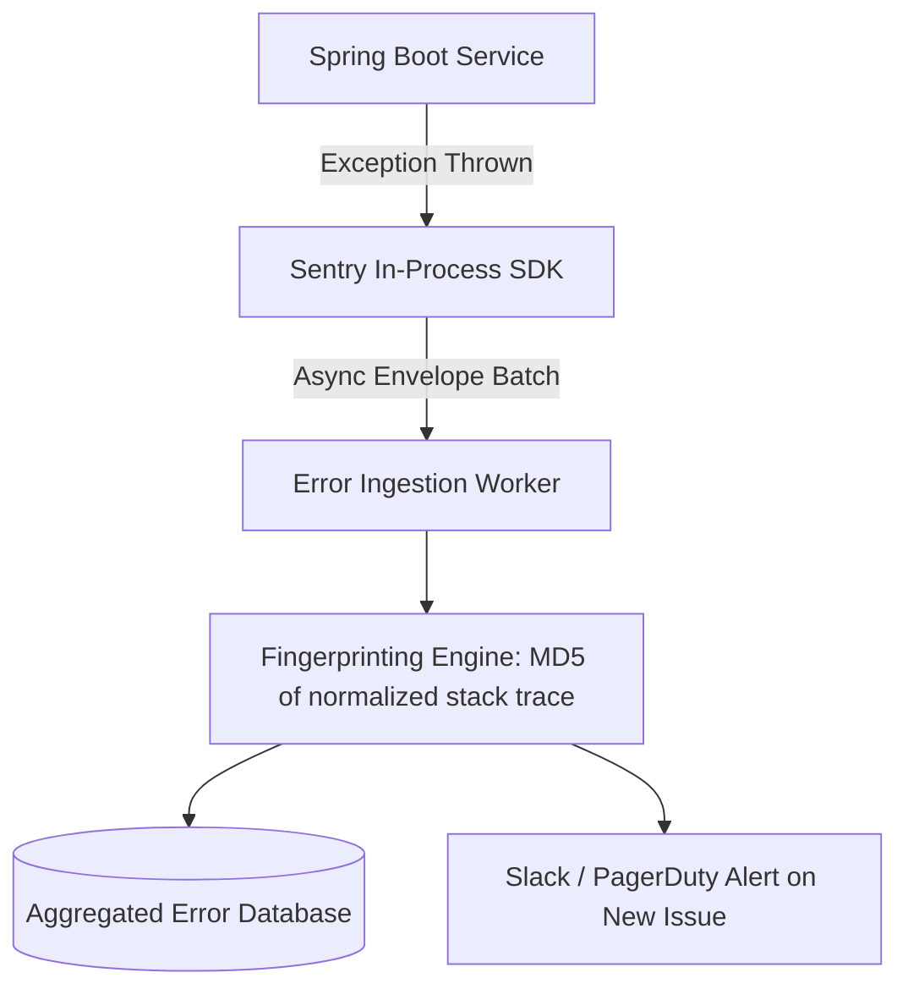

# Building Block 08: Server-Side Error Monitoring & Exception Aggregator

> **Module**: `06-building-blocks`
> **Reusability Category**: Ingress / Storage / Messaging / Coordination / Reliability / Telemetry

---

## 1. Problem
When microservices throw unhandled exceptions or crash, stack traces get buried inside gigabytes of raw logs across hundreds of servers, making root cause analysis impossible.

## 2. Requirements
- **Functional Requirements**: Provide robust, highly available, low-latency primitives for client and microservice workloads.
- **Non-Functional Requirements**:
  - **Availability**: $99.999\%$ uptime SLA (Five Nines).
  - **Latency**: $\text{p}99 < 5\text{ms}$ in-memory / $\text{p}99 < 50\text{ms}$ network hop.
  - **Scalability**: Linearly scale to millions of concurrent requests.

## 3. Why It Exists
Automated exception aggregators (like Sentry) capture stack traces, parse runtime context, group duplicate errors using signature hashing, and alert on new regression releases.

## 4. Mental Model
An automated triage hospital that groups identical injury reports into a single actionable incident for surgeons.

## 5. Core Concepts
Exception Capturing Agents, Stack Trace Normalization, Error Fingerprinting / Signature Hashing, Release Regression Tracking, Breadcrumbs Context.

## 6. Architecture

## 7. Request/Data Flow
1. Application catches unhandled exception. 2. SDK captures stack trace, OS, environment, and user breadcrumbs. 3. Hashes normalized stack frames into an Error Fingerprint. 4. Increments issue counter in DB. 5. Triggers alert if first occurrence.

## 8. Data Model
Error Event: `event_id (UUID)`, `fingerprint (STRING)`, `culprit (STRING)`, `stack_trace (JSON)`, `breadcrumbs (LIST)`, `count (INT64)`.

## 9. API Design
`POST /api/v1/projects/{id}/store/` with compressed gzip JSON envelope payload.

## 10. Algorithms
Stack Trace Normalization Algorithm (stripping line numbers and dynamic proxy frames to group identical bugs), MinHash for fuzzy grouping.

## 11. Scaling
Ingestion workers buffered by Kafka queues; storage in ClickHouse / PostgreSQL.

## 12. Partitioning
Sharded by Project ID and Error Fingerprint hash.

## 13. Replication
Multi-AZ database storage with replication factor of 3.

## 14. Consistency
Eventual consistency for aggregated issue count metrics.

## 15. Failure Scenarios
Spam / Error avalanche during total service outage, Ingestion queue memory exhaustion.

## 16. Recovery
Client-side sampling and adaptive rate limiting at the SDK level during error storms.

## 17. Observability
Ingested events/sec, dropped events rate, processing lag in ingestion workers.

## 18. Security
Sanitizing sensitive PII, credit cards, passwords, and authorization tokens before transmission.

## 19. Performance
Asynchronous background worker threads for error transmission to prevent blocking request threads.

## 20. Trade-offs
Full Fidelity (Capture every single error, high cost) vs Sampled (10% sample, lower cost, risk missing rare bugs).

## 21. When to Use
Real-time production bug detection, crash reporting, regression tracking during new deployments.

## 22. When NOT to Use
Metric counters (use Prometheus) or full raw access logging (use ELK).

## 23. Implementation Strategy
Integrate Sentry Java SDK with Spring Boot global `@ControllerAdvice` exception handler.

## 24. Practical Exercise
Trigger an unhandled `NullPointerException` across multiple simulated threads and verify fingerprint aggregation into a single issue.

## 25. Interview Questions
1. How does error fingerprinting work? 2. What are breadcrumbs in error tracking? 3. How do you prevent error tracking systems from falling over during a major outage?

## 26. Common Mistakes
Logging sensitive passwords or bearer tokens inside exception stack trace metadata.

## 27. Quick Revision
SDK captures stack trace -> Hashes fingerprint -> Deduplicates occurrences -> Alerts on regressions.

## 28. Related Building Blocks
`BB-07` (Monitoring), `BB-09` (Client Error Monitoring), `BB-16` (Logging)

## 29. Related Case Studies
All Case Studies (`CS-01` to `CS-20`)
