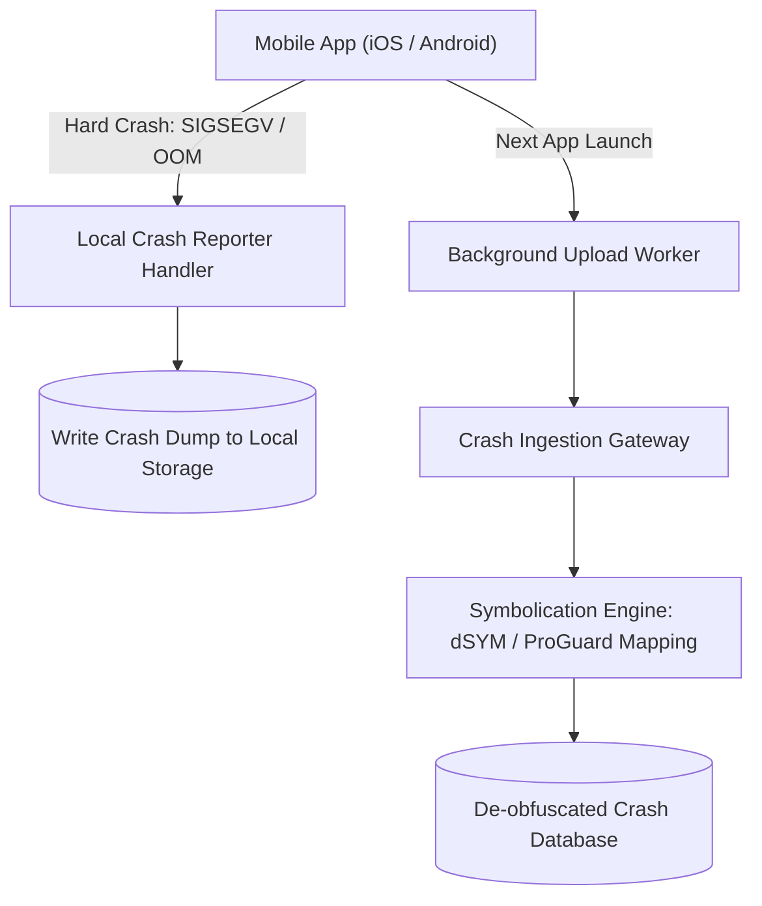

# Building Block 09: Client-Side Error Monitoring & Crash Reporter

> **Module**: `06-building-blocks`
> **Reusability Category**: Ingress / Storage / Messaging / Coordination / Reliability / Telemetry

---

## 1. Problem
Native mobile apps (iOS/Android) and frontend single-page web applications run on untrusted, unmonitored user devices across thousands of hardware variations, OS versions, and flaky networks.

## 2. Requirements
- **Functional Requirements**: Provide robust, highly available, low-latency primitives for client and microservice workloads.
- **Non-Functional Requirements**:
  - **Availability**: $99.999\%$ uptime SLA (Five Nines).
  - **Latency**: $\text{p}99 < 5\text{ms}$ in-memory / $\text{p}99 < 50\text{ms}$ network hop.
  - **Scalability**: Linearly scale to millions of concurrent requests.

## 3. Why It Exists
Unlike server backends where logs are directly accessible, mobile app crashes terminate the process instantly. Crash reporting SDKs persist crash dumps locally and upload them on next launch.

## 4. Mental Model
The 'Black Box' flight recorder on an airplane that records pilot actions and instrument readings right before an impact.

## 5. Core Concepts
Native Crash Handlers (PLCrashReporter, Breakpad), Minidumps, Symbolication / De-obfuscation (dSYM, ProGuard mapping), Crash-Free User Sessions rate.

## 6. Architecture

## 7. Request/Data Flow
1. App encounters unhandled signal (SIGSEGV). 2. Signal handler writes register state and stack trace to disk synchronously. 3. On next app reboot, background worker uploads dump. 4. Server symbolication engine maps raw memory addresses to exact code lines.

## 8. Data Model
Crash Report: `crash_id`, `app_version`, `os_version`, `device_model`, `memory_state`, `raw_threads (ARRAY)`, `symbolicated_stack (TEXT)`.

## 9. API Design
`POST /api/v1/crashes/upload` multipart payload containing binary minidump and metadata.

## 10. Algorithms
Address-to-symbol resolution using DWARF / dSYM debug information and ProGuard mapping files.

## 11. Scaling
Ingestion gateway scales horizontally behind anycast CDN; processing workers scale via Kafka queue.

## 12. Partitioning
Partitioned by App Bundle ID and OS platform.

## 13. Replication
Stored in distributed document stores with 3x replication.

## 14. Consistency
Eventual consistency for client reporting dashboards.

## 15. Failure Scenarios
Offline client devices accumulating crash reports, symbolication file mismatch for hotfix releases.

## 16. Recovery
Local disk cache with size caps (drop oldest dumps if > 10MB); version-matched dSYM storage in S3.

## 17. Observability
Crash-free session percentage (Target > 99.9%), crashes per 1,000 DAU, symbolication queue latency.

## 18. Security
Client payload encryption, stripping user location and PII from breadcrumb device state.

## 19. Performance
Zero-allocation native signal handlers to ensure crash dumps can be written even during out-of-memory (OOM) states.

## 20. Trade-offs
Immediate Upload (High battery/network usage) vs Next-Launch Batching (Delayed visibility, battery friendly).

## 21. When to Use
Mobile applications (iOS/Android), desktop apps (Electron), single-page web frontend applications.

## 22. When NOT to Use
Server-side microservice cluster exception tracking (use Sentry/ELK instead).

## 23. Implementation Strategy
Integrate Firebase Crashlytics or Sentry Android/iOS SDK into a mobile project with automated dSYM upload CI/CD step.

## 24. Practical Exercise
Simulate an Android native crash, verify minidump creation, and perform offline symbolication using ProGuard mapping.

## 25. Interview Questions
1. What is Symbolication and why is it necessary? 2. How do crash reporters write crash dumps during memory starvation? 3. What is Crash-Free Session Rate?

## 26. Common Mistakes
Attempting heavy network calls inside a SIGSEGV signal handler (causes immediate OS kernel termination).

## 27. Quick Revision
Crash handler persists dump to local storage -> Uploads on reboot -> Server symbolicates raw addresses to line numbers.

## 28. Related Building Blocks
`BB-08` (Server Error Monitoring), `BB-07` (Monitoring)

## 29. Related Case Studies
`CS-01` (YouTube), `CS-05` (Uber), `CS-08` (Instagram)
