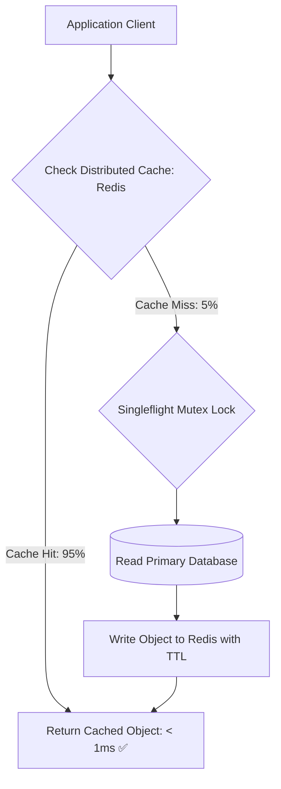

# Building Block 10: Distributed Cache (Redis & Multi-Tier)

> **Module**: `06-building-blocks`
> **Reusability Category**: Ingress / Storage / Messaging / Coordination / Reliability / Telemetry

---

## 1. Problem
Database disk I/O and complex queries cannot sustain hundreds of thousands of read requests per second with sub-5ms response times.

## 2. Requirements
- **Functional Requirements**: Provide robust, highly available, low-latency primitives for client and microservice workloads.
- **Non-Functional Requirements**:
  - **Availability**: $99.999\%$ uptime SLA (Five Nines).
  - **Latency**: $\text{p}99 < 5\text{ms}$ in-memory / $\text{p}99 < 50\text{ms}$ network hop.
  - **Scalability**: Linearly scale to millions of concurrent requests.

## 3. Why It Exists
Distributed in-memory caching stores pre-computed query results and frequently accessed objects in fast RAM, shielding databases from read saturation and reducing read latency from $50\text{ms}$ to $< 1\text{ms}$.

## 4. Mental Model
A high-speed desktop memory pad keeping the most important files right in front of you so you don't have to walk to the basement filing cabinet.

## 5. Core Concepts
Cache-Aside (Lazy Loading), Write-Through, Write-Behind (Write-Back), Eviction Policies (LRU, LFU, ARC), Cache Stampede, Thundering Herd, Singleflight, Redis Cluster partitioning.

## 6. Architecture

## 7. Request/Data Flow
1. Application queries cache key. 2. On hit: returns data instantly. 3. On miss: acquires distributed singleflight lock to prevent stampede. 4. Queries primary database. 5. Populates cache with TTL. 6. Returns data to client.

## 8. Data Model
Key-Value mapping: `Key (STRING) -> Value (STRING, HASH, LIST, SET, ZSET, BITMAP)`, expiration timestamp (`TTL`).

## 9. API Design
`GET key`, `SET key value EX seconds`, `DEL key`, `MGET key1 key2`, `HSET hash key value`.

## 10. Algorithms
LRU (Least Recently Used via Doubly Linked List + Hash Map), LFU (Least Frequently Used), Probabilistic Early Expiration (XFetch).

## 11. Scaling
Scale out horizontally using Redis Cluster with 16,384 hash slots distributed across $M$ primary shards.

## 12. Partitioning
Hash slot partitioning: `CRC16(key) % 16384` determines target Redis shard node.

## 13. Replication
Primary-Follower replication per shard with automated failover via Redis Sentinel / Raft coordinator.

## 14. Consistency
Weak / Eventual Consistency. Cache can become stale if database updates fail to invalidate cache entries.

## 15. Failure Scenarios
Cache Stampede (hot key expires under heavy traffic), Cache Penetration (queries for non-existent keys), Redis node crash.

## 16. Recovery
Probabilistic early expiration (XFetch), Bloom filters for cache penetration defense, automated Sentinel failover.

## 17. Observability
Cache Hit Ratio (Target > 90%), memory fragmentation ratio, eviction count per second, instantaneous QPS.

## 18. Security
Redis AUTH password, TLS encrypted transport, VPC private subnet isolation, disabling dangerous commands (`FLUSHALL`, `KEYS *`).

## 19. Performance
Non-blocking I/O multiplexing (`epoll`), pipelined batch operations (`MGET`/`MSET`), Redis Lua scripts for atomic operations.

## 20. Trade-offs
Write-Through (Immediate consistency, high write latency) vs Cache-Aside (Fast writes, stale read window).

## 21. When to Use
Read-heavy workloads, session storage, rate limiter token buckets, leaderboard sorted sets, pre-computed feeds.

## 22. When NOT to Use
Write-heavy workloads with near-zero read reuse, strictly ACID transactional ledgers requiring immediate linearizability.

## 23. Implementation Strategy
Deploy multi-tier caching: L1 In-Memory Caffeine cache inside Spring Boot microservice + L2 Redis Cluster with Singleflight.

## 24. Practical Exercise
Implement a concurrency-safe Cache-Aside wrapper in Java using Caffeine and Jedis with a Singleflight mutex lock.

## 25. Interview Questions
1. Explain Cache-Aside vs Write-Through vs Write-Behind. 2. How do you prevent a Cache Stampede (Thundering Herd)? 3. How does Redis Cluster partition keys across 16,384 hash slots?

## 26. Common Mistakes
Failing to set a TTL on cache keys, causing gradual memory leaks and stale data persistence.

## 27. Quick Revision
RAM Cache = Sub-millisecond reads; Cache-Aside = Lazy loading; Singleflight + XFetch = Stampede prevention.

## 28. Related Building Blocks
`BB-04` (Key-Value Store), `BB-13` (Rate Limiter), `BB-18` (Sharded Counter)

## 29. Related Case Studies
`CS-06` (Twitter / X), `CS-07` (Newsfeed), `CS-09` (TinyURL)
