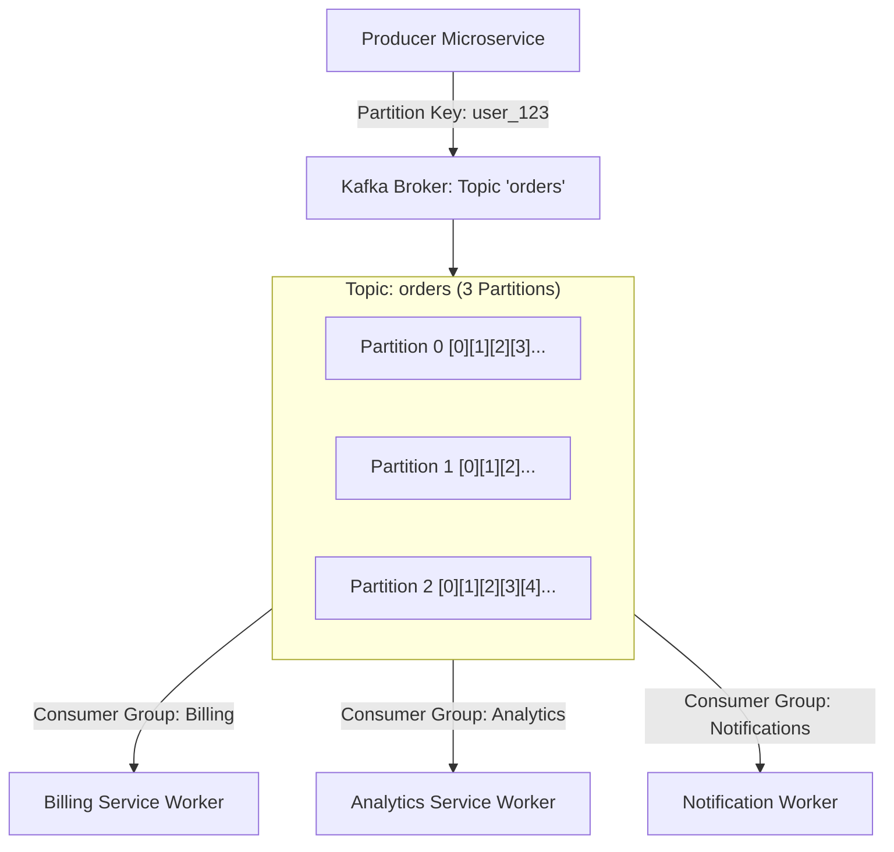

# Building Block 12: Distributed Pub/Sub (Apache Kafka)

> **Module**: `06-building-blocks`
> **Reusability Category**: Ingress / Storage / Messaging / Coordination / Reliability / Telemetry

---

## 1. Problem
Modern distributed platforms require streaming millions of events per second across multiple independent consumer microservices with historical replay, strict partition ordering, and fault tolerance.

## 2. Requirements
- **Functional Requirements**: Provide robust, highly available, low-latency primitives for client and microservice workloads.
- **Non-Functional Requirements**:
  - **Availability**: $99.999\%$ uptime SLA (Five Nines).
  - **Latency**: $\text{p}99 < 5\text{ms}$ in-memory / $\text{p}99 < 50\text{ms}$ network hop.
  - **Scalability**: Linearly scale to millions of concurrent requests.

## 3. Why It Exists
Traditional message queues delete messages once acknowledged by a single consumer. Kafka implements an append-only distributed commit log where multiple consumer groups independently read and replay events.

## 4. Mental Model
A distributed, high-speed newspaper publishing house where multiple distinct departments read from the continuous edition reel at their own reading pace.

## 5. Core Concepts
Topics, Partitions, Append-Only Commit Log, Producers, Consumer Groups, Offsets, In-Sync Replicas (ISR), Log Compaction, Zero-Copy I/O (`sendfile`), Page Cache.

## 6. Architecture

## 7. Request/Data Flow
1. Producer publishes event with partition key `hash(key) % num_partitions`. 2. Broker appends event sequentially to OS page cache & WAL. 3. Replicates to ISR quorum. 4. Consumer group reads sequentially from committed offset. 5. Periodically commits processed offset.

## 8. Data Model
Log Segment File: `Offset (INT64)`, `Timestamp (INT64)`, `Key (BYTE[])`, `Value (BYTE[])`, `Headers (MAP)`.

## 9. API Design
Kafka Producer/Consumer API (TCP Binary Protocol): `send(ProducerRecord)`, `poll(Duration)`.

## 10. Algorithms
MurmurHash2 for partition key hashing, Sequential I/O append, Zero-Copy OS Kernel Data Transfer (`sendfile`).

## 11. Scaling
Scale writes and storage horizontally by increasing topic partition count; scale consumers by matching consumer instances to partition count.

## 12. Partitioning
Partitioned by key: `MurmurHash2(key) % numPartitions`. Guarantees strict ordering per partition key.

## 13. Replication
Leader-Follower replication per partition across brokers; `min.insync.replicas = 2` with `acks = all` for zero data loss.

## 14. Consistency
At-least-once delivery (standard) or Exactly-once semantics (EOS via transactional producer + idempotency).

## 15. Failure Scenarios
Broker leader crash (ISR follower promoted in < 2s), Slow consumer / group rebalance, Out-of-order events across multiple partitions.

## 16. Recovery
Automated leader election via KRaft metadata quorum; consumer offset commit replay from last committed checkpoint.

## 17. Observability
Consumer Lag (Offsets behind leader), Under-replicated Partitions (URP), Ingestion Rate (MB/s), Bytes In/Out per broker.

## 18. Security
TLS in-transit encryption, SASL/SCRAM authentication, Kafka ACLs restricting topic read/write permissions.

## 19. Performance
Zero-copy disk reads via `sendfile()` bypassing user-space memory; heavy reliance on OS Linux Page Cache.

## 20. Trade-offs
High Throughput & Replay (Kafka) vs Complex Point-to-Point Routing & Instant Deletion (RabbitMQ).

## 21. When to Use
Event-driven architecture, change data capture (CDC via Debezium), real-time stream processing (Flink), metrics ingestion.

## 22. When NOT to Use
Simple task dispatch where point-to-point queues with individual message ACKs suffice (use RabbitMQ/SQS).

## 23. Implementation Strategy
Deploy Kafka cluster with KRaft, Spring Boot KafkaTemplate with idempotent producers (`enable.idempotence=true`), and manual offset commits.

## 24. Practical Exercise
Write a Java Spring Boot test producing 10,000 order events to Kafka with Testcontainers, verifying consumer group lag and offset commits.

## 25. Interview Questions
1. How does Kafka achieve massive write and read throughput? 2. What happens during a Consumer Group Rebalance? 3. Explain In-Sync Replicas (ISR) and `acks=all`.

## 26. Common Mistakes
Having more consumer instances in a consumer group than partitions (extra consumer instances remain completely idle).

## 27. Quick Revision
Kafka = Append-only commit log -> Partitioned by key -> Multiple consumer groups read independently via offsets.

## 28. Related Building Blocks
`BB-11` (Queue), `BB-28` (Event Bus), `BB-38` (Stream Processing)

## 29. Related Case Studies
`CS-05` (Uber), `CS-06` (Twitter / X), `CS-15` (Payment Gateway)
