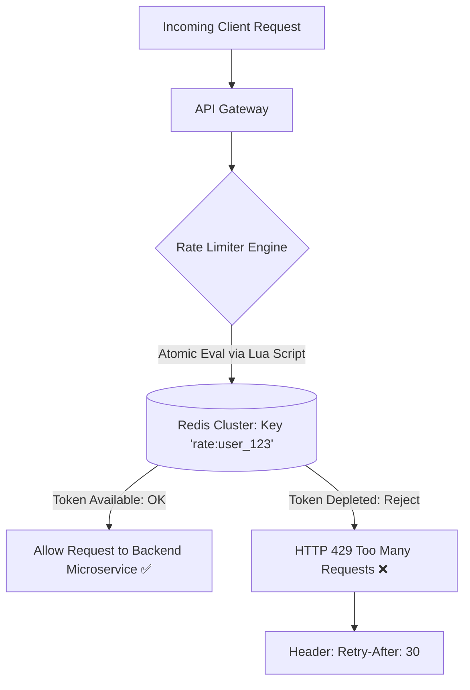

# Building Block 13: Distributed Rate Limiter

> **Module**: `06-building-blocks`
> **Reusability Category**: Ingress / Storage / Messaging / Coordination / Reliability / Telemetry

---

## 1. Problem
Malicious bots, runaway client loops, and sudden viral traffic spikes can saturate backend microservices and databases, causing total system outages.

## 2. Requirements
- **Functional Requirements**: Provide robust, highly available, low-latency primitives for client and microservice workloads.
- **Non-Functional Requirements**:
  - **Availability**: $99.999\%$ uptime SLA (Five Nines).
  - **Latency**: $\text{p}99 < 5\text{ms}$ in-memory / $\text{p}99 < 50\text{ms}$ network hop.
  - **Scalability**: Linearly scale to millions of concurrent requests.

## 3. Why It Exists
Rate limiters throttle excessive traffic at the API perimeter, enforcing Service Level Agreements (SLAs), protecting against DDoS attacks, and ensuring fair resource allocation.

## 4. Mental Model
A bouncer at a club entrance with a VIP counter allowing only a fixed number of guests per minute.

## 5. Core Concepts
Token Bucket, Leaky Bucket, Fixed Window Counter, Sliding Window Log, Sliding Window Counter, Distributed State via Redis Lua Scripts, Race Conditions, HTTP 429 Too Many Requests.

## 6. Architecture

## 7. Request/Data Flow
1. Request arrives at API Gateway with client IP/API Key. 2. Gateway executes atomic Redis Lua script. 3. Script checks tokens/timestamps in Sliding Window. 4. If under limit: decrements token and returns 1. 5. If limit exceeded: returns 0 with `Retry-After` seconds. 6. Gateway returns HTTP 429.

## 8. Data Model
Redis Key: `rate:{client_id}:{endpoint}` (Hash or Sorted Set of timestamps).

## 9. API Design
HTTP Headers: `X-RateLimit-Limit: 100`, `X-RateLimit-Remaining: 45`, `X-RateLimit-Reset: 1672531200`, `Retry-After: 15`.

## 10. Algorithms
Token Bucket (refills tokens at rate $r$), Sliding Window Counter (interpolates count between previous and current window).

## 11. Scaling
Scale horizontally by running stateless rate limiter filters inside API Gateway instances backed by a partitioned Redis cluster.

## 12. Partitioning
Redis keys sharded by client ID / IP: `CRC16(client_id) % 16384`.

## 13. Replication
Multi-AZ Redis Cluster with primary-standby replication.

## 14. Consistency
Eventual consistency across distributed edge nodes; atomic consistency within single Redis partition via Lua scripts.

## 15. Failure Scenarios
Redis node crash (fail-open vs fail-close policy), Network latency to Redis, Clock skew between API Gateway nodes.

## 16. Recovery
Fail-Open strategy (allow traffic to pass gracefully if Redis is temporarily unreachable), Local in-memory fallback cache.

## 17. Observability
Throttled Requests Rate (429s/sec), Allowed Requests Rate, Redis Lua execution latency (p99 < 1ms), Token refill lag.

## 18. Security
IP spoofing defense (validating `X-Forwarded-For` against trusted proxies), API Key hashing.

## 19. Performance
Executing rate limit logic in a single atomic Redis Lua script prevents network round-trip race conditions.

## 20. Trade-offs
Token Bucket (allows bursts) vs Leaky Bucket (smooth constant rate) vs Sliding Window Counter (accurate, low memory).

## 21. When to Use
Public API security, payment endpoint protection, user login brute-force prevention, tiered subscription monetization.

## 22. When NOT to Use
Internal microservice inter-thread scheduling (use local concurrency semaphores instead).

## 23. Implementation Strategy
Implement Sliding Window Counter in Spring Boot using `ReactiveRedisTemplate` and atomic Lua script with Redis cluster.

## 24. Practical Exercise
Simulate 1,000 concurrent requests against a 10 req/sec limit in Java using `CompletableFuture` and verify exactly 990 requests receive HTTP 429.

## 25. Interview Questions
1. Explain Token Bucket vs Sliding Window Counter. 2. Why are Redis Lua scripts mandatory for distributed rate limiting? 3. What is the Fail-Open vs Fail-Close policy?

## 26. Common Mistakes
Using naive `GET` and `SET` Redis commands without Lua scripts, creating race conditions under high concurrency.

## 27. Quick Revision
Rate Limiter = API Perimeter Defense -> Sliding Window Counter + Redis Lua = Atomic sub-ms throttling -> HTTP 429 on breach.

## 28. Related Building Blocks
`BB-02` (Load Balancer), `BB-10` (Distributed Cache), `BB-19` (API Gateway)

## 29. Related Case Studies
`CS-09` (TinyURL), `CS-15` (Payment Gateway), `CS-17` (ChatGPT)
