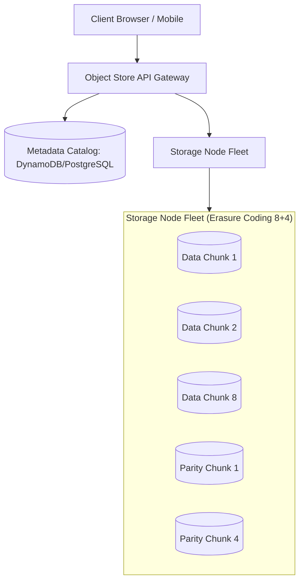

# Building Block 14: Distributed Blob / Object Store (Amazon S3)

> **Module**: `06-building-blocks`
> **Reusability Category**: Ingress / Storage / Messaging / Coordination / Reliability / Telemetry

---

## 1. Problem
Relational and NoSQL databases are horribly inefficient at storing massive binary unstructured objects (videos, high-res photos, software binaries, ML models) leading to high storage cost and database buffer pool bloat.

## 2. Requirements
- **Functional Requirements**: Provide robust, highly available, low-latency primitives for client and microservice workloads.
- **Non-Functional Requirements**:
  - **Availability**: $99.999\%$ uptime SLA (Five Nines).
  - **Latency**: $\text{p}99 < 5\text{ms}$ in-memory / $\text{p}99 < 50\text{ms}$ network hop.
  - **Scalability**: Linearly scale to millions of concurrent requests.

## 3. Why It Exists
Blob / Object Storage decouples unstructured payload storage from structured metadata. Blobs are chunked, encrypted, erasure-coded across inexpensive commodity hard drives, and addressed via immutable HTTP REST URLs.

## 4. Mental Model
A massive, infinitely expandable digital warehouse where each item is assigned a barcode (Key) and stored on the most cost-effective storage rack.

## 5. Core Concepts
Buckets, Keys, Objects, Multipart Upload, Range GET Requests, Erasure Coding (Reed-Solomon), Storage Tiering (Hot, Warm, Cold/Glacier), Presigned URLs, Immutability.

## 6. Architecture

## 7. Request/Data Flow
1. Client initiates Multipart Upload. 2. Splits 1GB file into 10MB chunks. 3. Uploads chunks in parallel to storage nodes. 4. Storage nodes apply Reed-Solomon Erasure Coding. 5. Metadata DB records object key, chunks, and MD5 ETag. 6. Finalizes upload.

## 8. Data Model
Object: `Bucket (STRING)`, `Key (STRING)`, `ETag (MD5)`, `Size (INT64)`, `StorageClass (HOT/COLD)`, `Chunks (ARRAY)`.

## 9. API Design
RESTful S3 API: `PUT /{bucket}/{key}`, `GET /{bucket}/{key}`, `DELETE /{bucket}/{key}`, `POST /{bucket}/{key}?uploadId=xxx`.

## 10. Algorithms
Reed-Solomon Erasure Coding (8 data chunks + 4 parity chunks = withstands loss of any 4 arbitrary disks with only 50% overhead).

## 11. Scaling
Scale out to Exabytes by adding commodity storage server racks; metadata tier scales independently on NoSQL / Spanner.

## 12. Partitioning
Objects partitioned by hash of bucket name and object key (`MD5(bucket + key)`).

## 13. Replication
Erasure coding across multiple failure domains / datacenters provides 99.999999999% (11 Nines) durability.

## 14. Consistency
Strong read-after-write consistency for PUT and DELETE operations of objects.

## 15. Failure Scenarios
Disk drive failure (automated erasure reconstruction in background), Network bottleneck during multi-gigabyte upload.

## 16. Recovery
Background bitrot detection and automatic chunk repair using parity chunks; resumed multipart uploads on connection drop.

## 17. Observability
Ingress / Egress Bandwidth (GB/s), Request Latency (TTFB < 50ms), Active Storage Volume (Petabytes), Replication / Parity repair queue.

## 18. Security
Bucket policies, IAM roles, SSE-S3 / SSE-KMS encryption at rest, Presigned URLs with short expiration TTL for direct client upload.

## 19. Performance
Direct-to-S3 client uploads via Presigned URLs (bypasses backend API servers completely), Byte-Range parallel downloads.

## 20. Trade-offs
Replication Factor of 3 (300% storage cost, fast read) vs Erasure Coding (130%-150% storage cost, compute overhead during recovery).

## 21. When to Use
Video files, user photo uploads, backup archives, big data analytics files (Parquet/ORC), ML training datasets.

## 22. When NOT to Use
High-frequency transactional updates, structured records requiring sub-millisecond atomic row mutations.

## 23. Implementation Strategy
Use AWS S3 / MinIO with Presigned URLs for direct client uploads, lifecycle policies for S3 Glacier archiving, and CloudFront CDN integration.

## 24. Practical Exercise
Implement a Spring Boot service generating S3 Presigned Upload URLs, perform a multipart upload of a 100MB file, and verify MD5 ETag.

## 25. Interview Questions
1. How does Erasure Coding achieve 11 Nines of durability at lower cost than 3x replication? 2. How do Presigned URLs eliminate application server bandwidth bottlenecks? 3. What is Multipart Upload?

## 26. Common Mistakes
Streaming heavy video/image uploads through backend microservice application servers instead of directly to S3 via Presigned URLs.

## 27. Quick Revision
Blob Store = Infinite unstructured storage -> Metadata separated from data chunks -> Erasure Coding = 11 Nines durability.

## 28. Related Building Blocks
`BB-05` (CDN), `BB-10` (Cache), `BB-30` (Audit Log)

## 29. Related Case Studies
`CS-01` (YouTube), `CS-08` (Instagram), `CS-14` (CI/CD Deployment)
